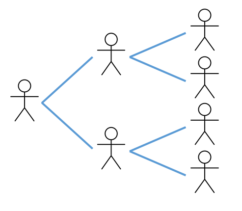

::: {.hidden}
$$
\newcommand{\vect}[1]{\boldsymbol{\mathbf{#1}}}
\newcommand{\R}{\mathcal{R}}
\newcommand{\Reff}{\mathcal{R}_\mathrm{eff}}
$$
:::

# Preliminaries



# Branching processes

Epidemic dynamics are the result of many individual transmission events, which can be represented as a *branching process* (@fig-branching-process).

{width=300 #fig-branching-process}

A key quantity is the average number of people that an infected individual transmits the disease to.

The key factors affecting this quantity are:

* The average duration of the infectious period, $t_I$.
* The average number of contacts an individual has with other individuals per unit time, $c$.
* The probability the disease is transmitted when an infectious individual contacts a susceptible individual, $p$.
* The probability that a contact is susceptible, $s$. 

# Basic reproduction number

The *basic reproduction number* $\mathcal{R}_0$ is a pivotal quantity in ID modelling and is defined as follows:

::: {.callout-note}
### Basic reproduction number
The basic reproduction number $\mathcal{R}_0$ is the expected number of infections caused by a single infectious individual in a fully susceptible population over the course of their infectious period.
:::

Notes: 

* As will see, one of the reasons $\mathcal{R}_0$ is so important is that it is a *threshold quantity* for epidemic models. Generally speaking, an epidemic can occur only if $\R_0>1$.
* It is important to remember that $\mathcal{R}_0$ is the *average* number of infections - in reality there may be substantial variation from one person to another. 

Let us begin by assuming that the population is homogeneous, so everyone has the same average contact rate $c$. When the population is fully susceptible, we have $s=1$. Therefore the basic reproduction number can be expressed as the product of the duration of infectiousness $t_I$, the contact rate $c$, and the probability of transmission $p$:

::: {.callout-note}
### $\R_0$ in a homogeneous population

$$
\R_0 = pct_I
$$
:::

# Effective reproduction number

The basic reproduction number $\R_0$ quantifies the number of transmissions per infected individual when the population is fully susceptible. More generally, we define the *effective reproduction number* $\R_\mathrm{eff}(t)$ as follows.

::: {.callout-note}
### Effective reproduction number 

The effective reproduction number $\R_\mathrm{eff}(t)$ is the expected number of infections caused by a single infectious individual over the course of their infectious period when some fraction $S(t)/N$ of the population is susceptible.
:::

In addition to assuming that the population is homogeneous, we also assume it is well-mixed, meaning that contacts are drawn randomly from the whole population. This implies that $s=S(t)/N$ where $S(t)$ is the number of susceptible individuals and $N$ is the population size. Hence the effective reproduction number at time $t$ is
$$
\R_\mathrm{eff}(t) = pct_I\frac{S(t)}{N} = \R_0 \frac{S(t)}{N}
$$

::: {.callout-tip}
### DOTS framework for $\R_0$

A useful way to think of this is that the effective reproduction number is the product of four factors (DOTS):

1. **Duration** of infectiousness ($t_I$).
1. **Opportunities** for transmission (i.e. the contact rate $c$).
1. **Transmission probability** ($p$).
1. **Susceptibility** of the population $S(t)/N$.
:::

This can be useful for thinking heuristically about how interventions might affect $\R_\mathrm{eff}(t)$. For example, treatment may shorten the duration of infectiousness, school closures or working from home reduce opportunities for transmission, masks or distancing interventions are designed to reduce the transmission probability, and vaccination reduces susceptibility.

# Modelling choices

There are lots of choices in how different aspects of the process are modelled. For example:

* Are there important interventions you want to include in the model such as vaccination or case isolation?
* Does the population have any pre-existing immunity?
* Does recovery from infection provide immunity to reinfection?
* Does immunity (either from vaccination or prior infection) wane over the time period of interest?
* Are births, deaths and ageing likely to have a major impact over the time period you are modelling or can they be ignored?
* What is the temporal relationship between time of infection and time of onward transmission, e.g. is there a long latent period? Is there a lot of variation in transmission times or are they relatively consistent? 
* Is age structure important? 
* Are stochastic effects important (e.g. is the number of infections relatively small?) or can we use a deterministic model?
* Are there specific population subgroups that are of interest, for example because they have different susceptibility or clinical risk.
* People are different and behave in different ways that affect the dynamics of disease transmission. How much of this heterogeneity is important and how much can you feasibly include in a model? 
* What type of data is available to calibrate and validate the model?

As a result there are many variations of infectious disease model. Adding model features or additional model complexity does not always make a model better. Simple models have the advantage that they enable the key factors driving the transmission dynamics to be understood. 

The appropriate complexity and type of model will depend on the question being asked and the data available. However, almost all of them contain a transmission process of the kind outlined above at their core.

# Deterministic approximation

We will return to stochastic models in Topic 6, but for now we consider a deterministic model which describes the average behaviour of the epidemic in a large population.

Suppose at some point in time $t$, there are $S(t)$ susceptible individuals, $I(t)$ infectious individuals and $R(t)$ recovered individuals. In a short time interval $[t,t+\delta t]$, each infectious individual will make an average of $c\delta t$ contacts. As the contacts are chosen randomly, the probability that each contact is susceptible is $S(t)/N$, so the expected number of contacts between an infectious and a susceptible individual is $cI(t)S(t)/N \delta t$. And finally, since the probability of transmission given contact between a susceptible and an infectious individual is $p$, we have
$$
\textrm{expected number of new infections} = \frac{pcI(t)S(t)}{N} \delta t
$$

In addition, suppose that each infectious individual has probability $\gamma \delta t$ of recovering in the time interval $[t,t+\delta t]$, so
$$
\textrm{expected number of recovery events} = \gamma I(t) \delta t
$$

Note: this implies that the infectious period is exponentially distributed with mean $t_I=1/\gamma$. This simplifies the mathematics considerably, but we will return to more general models that do not make this assumption later on.

From the above, we can calculate the expected change in $S(t)$, $I(t)$ and $R(t)$ between $t$ and $t+\delta t$:
$$
\begin{align*}
\textrm{change in S} &= -\textrm{expected number of transmission events} \\
\textrm{change in I} &= \textrm{expected number of transmission events} - \textrm{expected number of recovery events}\\
\textrm{change in R} &=  \textrm{expected number of recovery events}
\end{align*}
$$

Or in mathematical notation:
$$
\begin{align*}
\delta S &= -\frac{pcI(t)S(t)}{N} \delta t \\
\delta I &= \frac{pcI(t)S(t)}{N} \delta t - \gamma I(t) \delta t\\
\delta R &=   \gamma I(t) \delta t
\end{align*}
$$

Dividing through by $\delta t$, taking the limit $\delta t\to 0$, and defining $\beta=pc$, we obtain the canonical SIR ordinary differential equation model:

::: {.callout-note}
### SIR model

$$
\begin{align*}
\frac{dS}{dt} &= -\frac{\beta IS}{N} \\
\frac{dI}{dt} &= \frac{\beta IS}{N}  -  \gamma I \\
\frac{dR}{dt} &= \gamma I 
\end{align*}
$$
:::

This is known as a compartment-based model because it splits the population into three compartments ($S$, $I$ and $R$) and treats everyone in the same compartment as identical. This model is the subject of Topic 2.

