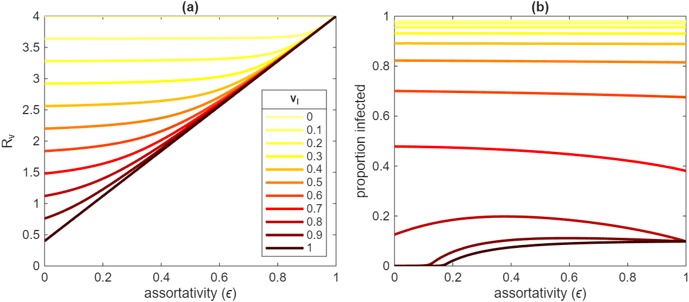

::: {.hidden}
$$
\newcommand{\vect}[1]{\boldsymbol{\mathbf{#1}}}
\newcommand{\R}{\mathcal{R}}
\newcommand{\Reff}{\mathcal{R}_\mathrm{eff}}
$$
:::

# Vaccine modelling considerations

There various ways in which vaccination can be included in a compartment-based model. In the real-world, vaccines are not 100\% effective, so it is usually important to model partially effective vaccines.

There are many considerations in including vaccination in infectious disease models. For example:

* Does the vaccine reduce susceptibility to infection, does it reduce the likelihood of onward transmission, does it reduce the risk of severe disease or death, or does it do all three to varying degrees?
* Does the vaccine reduce everyone's infection hazard by some factor $a$ (called a leaky vaccine), or does it provide perfect immunity for some proportion $a$ of people, while leaving the remaining proportion unprotected (called an all-or-nothing vaccine)? Or something in between? 
* Is some fixed proportion of the population vaccinated before the epidemic begins, or is the epidemic occurring simultaneously with vaccinations? 
* Is vaccine-induced immunity permanent (or long-lasting enough for the time period under consideration) or does it wane over time? 
* What happens if people can have multiple doses of the same vaccine? 
* How are vaccines distributed by age?

# All-or-nothing vaccine model

These are all important questions to consider when modelling vaccination. For now, we will take a very simplified approach of assuming that some fraction $p_v\in[0,1]$ of the population is vaccinated at $t=0$, and that the vaccine perfectly immunises some fraction $v_I\in[0,1]$ (for vaccine effectiveness against infection) of people and has no effect in the remainder.

This can be modelled by the standard SIR model
$$
\begin{align*}
\dot{S} &= -\frac{\beta SI}{N} \\
\dot{I} &= \frac{\beta SI}{N} - \gamma I 
\end{align*}
$$ {#eq-SIR}
the only difference being that the initially susceptible fraction $S(0)$ is $1-p_v v_I$ instead of close to $1$. This means that the reproduction number with vaccination, denoted $\R_v$, is equal to $\R_0(1-p_v v_I)$.

::: {.callout-note}
### Vaccinated reproduction number

The vaccinated reproduction number $\R_v$ in a homogeneous population with vaccine coverage $p_v$ and vaccine effectiveness against infection $v_I$ is
$$
\R_v = \R_0(1-p_vv_I)
$$

:::

Note that $\R_v\le\R_0$ and increasing either vaccine coverage $p_v$ or vaccine effectiveness $v_I$ reduces $\R_v$.

We can also infer that the vaccine has a dual effect on the size of the epidemic (see previous section on Final Size): a smaller fraction of the susceptible population is infected (because the reproduction number is lower), and the susceptible population itself is also smaller.

We can calculate the minimum coverage $p_v^*$ required to reduce $\R_v$ below $1$ and hence prevent an epidemic:

::: {.callout-note}
### Minimum vaccine coverage for herd immunity

$$
p_v^* = \frac{1 - \frac{1}{\R_0}}{v_I}
$$
:::

Note that the required vaccine coverage increases as $\R_0$ increases or as $v_I$ decreases: if the disease is more transmissible or the vaccine is less effective then need more people to be vaccinated to reach herd immunity.

And of course if $p_v^*>1$ (which is true if and only if $v_I< 1-1/\R_0$ ), then herd immunity cannot be achieved by vaccination: even if the entire population is vaccinated, the vaccine is not effective enough to prevent an epidemic. 

# A simple leaky vaccine model

Now suppose the vaccine is leaky, meaning nobody is perfectly protected but instead the vaccine reduces people's infection hazard by a factor $v_I$. This can be modelled by a modified version of the SIR equations in which we use $S_U$ and $S_V$ to denote the unvaccinated and vaccinated susceptible compartments respectively (and similarly for the other compartments):
$$
\begin{align*}
\dot{S_U} &= -\lambda S_U \\
\dot{S_V} &= -(1-v_I)\lambda S_V \\
\dot{I_U} &= -\lambda S_U - \gamma I_U \\
\dot{I_V} &= -(1-v_I)\lambda S_V - \gamma I_V \\
\end{align*}
$$
where the force of infection (or infection hazard) on fully susceptible (i.e. unvaccinated) individuals $\lambda$ is defined by 
$$
\lambda(t) = \beta \left( I_U(t)+I_V(t) \right)
$$
The reproduction number for models of this type can be calculated using the *next generation matrix* $K$, which is a matrix whose $(i,j)$ element denotes the expected number of infections of type $j$ caused by a single infectious individual of type $i$ in a fully susceptible population. In Topic 10, we will see a method for rigorously deriving the next generation matrix from the model equations, but for now an informal argument will suffice.

By assumption, the vaccine does not affect transmission once someone has got infected, so all infected individuals are essentially identical. Because we assume the population is well-mixed, the proportion of an individual's contacts that are with vaccinated people is $p_v$ and the remainder are with unvaccinated people (we will explore the conseqeucnes of relaxing this assumption below). 

Hence, an infected individual will infect $(\beta/\gamma) (1-p_v)$ unvaccinated individuals, on average. If the vaccine had no effect, they would also infect $(\beta/\gamma)  p_v$ vaccinated individuals. But since the vaccine the susceptibility, they actually only infect $(\beta/\gamma) p_v (1-v_I)$ vaccinated individuals on average.

Hence, the vaccinated reproduction number is 
$$
\R_v = \frac{\beta}{\gamma} \left(1 - p_v + p_v(1-v_I)\right) =  \R_0 \left(1 - p_v v_I\right)
$$
Note that $\R_v$ for this simple leaky vaccine model is the same as for the all-or-nothing model (and hence the vaccine coverage required for herd immunity is the same as well). 

However, when an epidemic occurs (i.e. when $\R_v>1$), its final size is larger in the leaky vaccine than in the all-or-nothing vaccine.
To see this, consider the respective reproduction numbers of the the models after there have been $C$ cumulative infections (relative to population size). For the all-or-nothing model, the susceptible compartment is depleted by an amojunt $C$ and so we have
$$
\R_\mathrm{eff} = \R_0\left(1 - p_v v_I - C\right) 
$$
For the leaky vaccine model, the $C$ infections are made up of $C_U$ unvaccinated people and $C_V$ vaccinated people with $C=C_U+C_V$. The $S_U$ and $S_V$ compartments are depleted by $C_U$ and $C_V$ respectively, and so we find that
$$
\begin{align*}
\R_\mathrm{eff} &= \R_0\left(1 - p_v - C_u + (1- v_I)(p_v - C_v) \right) \\
&= \R_0\left(1 - p_v v_I - C_u - (1-v_I) C_v \right) 
\end{align*}
$$
Provided $0<v_I<1$, we can see that, for any given $C>0$, the effective reproduction number for the leaky vaccine model is always higher than for the all-or-nothing model.

One way to understand this is to consider the immunity gained as a result of a single infection. In the all-or-nothing model, the infected person always goes from zero immunity (whether unvaccinated or vaccinated but with vaccine failure) to full immunity. In the leaky model, when a unvaccinated person is infected, they go from zero to full immunity, but when a vaccinated person is infected, they already have partial immunity so the net increase in immunity is smaller. Hence it takes more infections to reach the same level of population immunity as in the all-or-nothing model. 

# Modelling a dual-effect vaccine

Now suppose that, in addition to reducing the force of infection by $v_I$, the vaccine also reduces the transmission rate from infected vaccinated individuals by $v_T$ (vaccine effectiveness against transmission).

We can include this in the model using the same system of ODEs but with a small modification to the force of infection $\lambda$:
$$
\lambda(t) = \beta \left( I_U + (1-v_T)I_V  \right)
$$

Now we need to write down the next generation matrix $K$:
$$
K = \R_0 \left[\begin{array}{ll} 1-p_v &  (1-p_v)(1-v_T)  \\  p_v(1-v_I)  & p_v(1-v_I)(1-v_T)   \end{array}   \right]
$$
where $K_{11}$ is the average number of unvaccinated individuals infected by a single unvaccinated infectious person, $K_{21}$ is the average number of vaccinated individuals infected by an unvaccinated infectious person, and so on. We will see a rigorous method for deriving next generation matrices for models such as this in Topic 10.

If the number of new infections in generation $n$ in the unvaccniated and vaccinated populations is given by some vector ${\bf v}$, then corresponding number of new infections in generation $n+1$ is given by $K{\bf v}$.
Recall from linear algebra that, under fairly general conditions, the matrix-vector product $K^n{\bf v}$ tends towards $\rho(K)^n {\bf v^*}$ as $n$ becomes large, where $\rho(K)$ is the dominant eigenvalue of $K$ and $v^*$ is the corresponding eigenvector. Thus the number of new infections at generation $n+1$ is $\rho(K)$ times the number at generation $n$, and so the reproduction number is equal to $\rho(K)$.

The eigenvalues for the matrix $K$ above are $\lambda_1=0$ and $\lambda_2= \R_0\left(1-p_v+p_v(1-v_I)(1-v_T)\right)$. $\lambda_2$ is the dominant eigenvalue and so we obtain the following result.

::: {.callout-note}
### Vaccinated reproduction number for a dual-effect vaccine

The vaccinated reproduction number $\R_v$ in a homogeneous population with vaccine coverage $p_v$, vaccine effectiveness against infection $v_I$ and vaccine effectiveness against transmission conditional on infection $v_T$ is

$$
\R_v = \R_0\left(1 - p_v(v_I+v_T-v_I v_T) \right)
$$

:::

Note that this would be the same $\R_v$ as a different vaccine with $v_T'=0$ and  $v_I'=v_I+v_T-v_I v_T$. We say that the combined vaccine effectiveness against transmission is $v_I+v_T-v_Iv_T$. This shows that the effectiveness against infection and effectiveness against transmission are sub-additive. For example, a vaccine with $v_I=0.4$ and $v_T=0.4$ has the same effect on the reproduction number as a vaccine with $v_I=0.64$ and $v_T=0$.

# A leaky vaccine model with assortative mixing

The models above assume that, if a fraction $p_v$ of the population is vaccinated, then the fraction of any individual's contacts who are vaccinated is also $p_v$, regardless of whether that person is themself vaccinated or not. This is called a *proportionate mixing* model. 

In some cases, it may be that people are more likely to mix with others who have the same vaccination status. This is known as *assortative mixing* and we will see more on this in Topics 10 and 11. For now, let us suppose that the fraction of a vaccinated person's contacts who are also vaccinated is $(1-\epsilon)p_v + \epsilon$ for some constant $\epsilon\in[0,1]$. Similarly, suppose that the fraction of an unvaccinated person's contacts who are vaccinated is $(1-\epsilon)p_v$.

Note that when $\epsilon=0$ this reduces to the proportionate mixing model, while when $\epsilon=1$ people *only* mix with other people of the same vaccination status (an extreme example of assortative mixing).

For simplicity, we will focus on the case where the only effect of the vaccine is to reduce susceptibility (i.e. $v_T=0$). Then the next generation matrix $K$ is
$$
K = \R_0 (1-\epsilon)   \left[\begin{array}{ll} 1-p_v & 1-p_v \\ p_v(1-v_I) & p_v(1-v_I)      \end{array}   \right]  + \R_0\epsilon \left[\begin{array}{ll} 1 & 0 \\ 0 & 1-v_I    \end{array}   \right]
$$

Note that when $\epsilon=0$, the NGM reduces to the matrix seen in the proportionate mixing model above (with $v_T=0$) and we recover the same expression for the reproduction number $\R_v = \R_0(1-p_v v_I)$.

When $\epsilon=1$, unvaccinated individuals transmit to an average of $\R_0$ other unvaccinated individuals, while vaccinated individuals transmit to an average of $\R_0(1-v_I)$ other vaccinated individuals. This leads to a reproduction number of $\R_v=\R_0$, i.e. vaccination does not change the reproduction number! This is because, in the $\epsilon=1$ case, there are two independent epidemics happening: one in the vaccinated population and one in the unvaccinated population. Because the latter has a faster epidemic growth rate, the fraction of infections that are in the unvaccinated group tends towards $1$ and so the reproduction number reflects the average number of people infected by an unvaccinated individual, which is $\R_0$.

For the more realistic case where the value of $\epsilon$ is intermediate between $0$ and $1$, the dominant eigenvalue of $K$ has a more complicated algebraic expression. However, the special case where $v_I=1$ (i.e. a perfect vaccine) is instructive: here the dominant eigenvalue is given by
$$
\R_v = \R_0\left(  1- p(1-\epsilon)  \right)
$$
In other words, increasing levels of assortative mixing (i.e. increasing $\epsilon$) linearly reduces the effect of vaccination on the reproduction number. This statement should not be misconstrued as saying that the vaccine has less benefit when mixing is assortative: the size of the epidemic may still be substantially reduced by the vaccine even if the effect on the reproduction number is relatively small. 

@fig-assortative-mixing shows that, while assortativity always increases the reproduction number, its effect on final epidemic size is more complicated. For low to moderate values of the vaccine effectivness, where $\R_v$ is well above $1$, assortativity either has no effect on final size, or slightly reduces it. When vaccine effectiveness is high, assortativity can be enough to tip the reproduction number from below 1 to above 1 (e.g. $v_I=0.9$ and $1.0$ in @fig-assortative-mixing). 

When the reproduction number without assortativity is only just above 1 (e.g. $v_I=0.8$ curve in @fig-assortative-mixing), the effect of assortativity is non-monotonic, with the largest epidemics occurring for intermediate values of $\epsilon$. 
The reason this happens is that although assortativity increases the reproduction number, when assortativity is very high, the epidemic effectively cannot spread in the vaccinated population so the final size is limited by the size of the unvaccinated population.

{#fig-assortative-mixing}

# Modelling vaccine protection against severe disease and death

Many vaccines provide a higher level of protection against severe disease or death than against infection and transmission. There are different ways to model this kind of situation. For example, we could explicitly include compartments for cases that are relatively mild and cases that are sick enough to need a given level of healthcare such as hospital treatment. 

If progression to more severe outcomes does not affect the likelihood of transmission, a simpler approach is possible and we illustrate this here. 

Suppose that, in the unvaccinated group, the epidemic dynamics are governed by 
$$
\begin{align*}
\dot{S_U} &= -\lambda S_U \\
\dot{I_U} &= \lambda S_U - \gamma I_U \\
\end{align*}
$$

Suppose also that, in the absence of vaccination, the proportion of infections that cause death (known as the *infection fatality ratio*) is $p_d$. Then, assuming for simplicity that the average time from infection to death is the same as the average time from infection to recovery, the cumulative number of deaths in the unvaccinated group $D_U$ satisfies
$$
\dot{D_U} = p_d \gamma I_U
$$

Suppose that, conditional on infection, the vaccine reduces the risk of death by a factor $v_S\in[0,1]$. Then we have a similar set of equations for the vaccinated group, but with a proportion $p_d(1-v_S)$ of infections resulting in death:
$$
\begin{align*}
\dot{S_V} &= -\lambda(1-v_I) S_V \\
\dot{I_V} &= \lambda(1-v_I) S_V - \gamma I_V \\
\dot{D_V} &= p_d(1-v_S)\gamma I_V
\end{align*}
$$

Assuming unvaccinated and vaccinated individuals have the same transmission rate, we have
$$
\lambda(t) = \beta\left( I_U+I_V\right)
$$
Note technically this is a density-dependent model for $\lambda(t)$ because we have not accounted for the fact that deaths deplete the total population size and thus, for a given value of $I_U+I_V$s, increase the likelihood of contact with an infective -- see Topic 2. However provided $p_d$ is not too large the difference is likely to be negligible.

As before, we could model a vaccine effectiveness against transmission by multiplying all the vaccinated compartments by $1-v_T$ in the expression for $\lambda(t)$, but we omit this for simplicity. 

## Aggregate vaccine effectiveness against death

Unvaccinated individuals get infected at rate $\lambda$ and, if infected, have risk $p_d$ of death. In contrast, vaccinated individuals get infected at rate $(1-v_I)\lambda$ and, if infected, have risk $(1-v_S)p_d$ of death. So the overall risk of death for vaccinated individuals relative to unvaccinated individuals is $(1-v_I)(1-v_S)$. 

Hence the aggregate vaccine effectiveness against death is:
$$
\begin{align*}
\textrm{VE against death} &= 1-\frac{\textrm{risk for vaccinated}}{\textrm{risk for unvaccniated}} \\
&= 1- (1-v_I)(1-v_S) \\
&= v_I + v_S - v_Iv_S
\end{align*}
$$

## Proportion of deaths that occur in the vaccinated population

The rate at which fatal infections occur in unvaccinated individuals is $p_d \lambda  S_U$, while for vaccinated individuals this is $p_d (1-v_I)(1-v_S)\lambda S_V$. It follows that the proportion of deaths that occur in vaccinated individuals is
$$
\textrm{proportion vaccinated} = \frac{(1-v_I)(1-v_S) q_v}{(1-v_I)(1-v_S)q_v + 1-q_v}  
$$

where $q_V(t)=S_V(t)/(S_U(t)+S_V(t))$ is the fraction of the susceptible population at time $t$ that is vaccinated. This fraction will vary over the course of the epidemic. At the beginning of the epidemic, when the cumulative number of infections is negligible, we have $q_v=p_v$ (i.e. $q_v$ is the same as the vaccine coverage). 

However, as the epidemic progresses, unvaccinated people are infected at a higher rate (provided $v_I>0$), meaning that the $S_U$ compartment is depleted faster than the $S_V$ compartment. As a result, $q_v$ increases with time, and therefore so too does the proportion of deaths that are in the vaccinated population.

Note: the above shows that it is impossible to gauge vaccine effectiveness just by looking at the fraction of deaths that are in vaccinated people. If $p_v$ is very high, this fraction will also be high (and increasing over time), even if the vaccine is highly effective. 

## Apparent death rate

Because vaccines affect who is getting infected as well as their risk of death, they can change the *apparent severity* (i.e. the proportion of infections that cause death) in different ways.

Infections occur at total rate $\lambda \left(S_U + (1-v_I)S_V\right)$, while fatal infections occur at rate $p_d \lambda  \left( S_U + (1-v_I)(1-v_S)S_V\right)$.

It follows that the overall fraction of infections that cause death is:
$$
\textrm{proportion of infections that cause death} = p_d \frac{1-q_v( v_I +v_S - v_I v_S) }{1-q_v v_I }
$$

Notice that when $v_I=1$, this proportion is equal to $p_d$ (the same as in the absence of a vaccine) because only unvaccinated people get infected. On the other hand, when $v_I=0$, the proportion is $p_d(1-q_v v_S)$. So counterinitivitvely, the more effective the vaccine is against infection, the greater the proportion of infections that will cause death (i.e. the larger the apparent infection fatality ratio) because a larger fraction of infections occur in unvaccinated people. 

In this section we have considered deaths, but a similar argument could be applied to other defined outcomes such as hospitalisation or ICU admission. 

