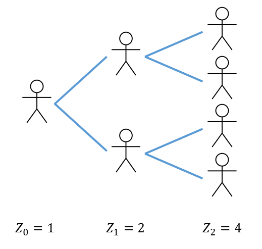

::: {.hidden}
$$
\newcommand{\vect}[1]{\boldsymbol{\mathbf{#1}}}
\newcommand{\R}{\mathcal{R}}
\newcommand{\Reff}{\mathcal{R}_\mathrm{eff}}
\newcommand{\inc}{\mathrm{inc}}
$$
:::

# Introduction

So far we have focused mainly on deterministic compartment-based models. Stochastic models are another class of model that capture random variability in the transmission process.
There are two main situations where deterministic models are inappropriate and stochastic models are required:

1. When the population within which the disease is spreading is small.
1. When the number of infectives is small, which may occur at the beginning or end of an outbreak even in a large population.

In these situations, random fluctuations in the number of cases infected per person can make a big difference. This can cause significant uncertainty in key epidemic properties, such as the final epidemic size. Although deterministic models predict that an epidemic will always occur if $\R_0>1$, it is possible that if an outbreak starts with only a handful of infectives, the epidemic will fail to take by chance. As we shall see, stochastic models provide a way to account for and quantify this possibility.

Stochastic models may be used in other situations too. For example, if it is necessary to include a lot of individual-level heterogeneity in the model, a stochastic agent-based model may be preferred because the number of compartments may be too large for a compartment-based model to be practical. Complex stochastic individual-based models do have drawbacks: they tend to be more computationally intensive and can more difficult to calibrate to data. 

Here, we begin with one of the simplest stochastic models of infectious disease transmission. 
As we saw in Part 1, a branching process is a natural way to model the spread of an infectious disease. We will study a highly simplified branching process model where transmission events from one generation to the next occur at discrete points in time. This means that the branching process consists of a series of *non-overlapping generations*, which simplifies the analysis.

This model is important because it provides some key insights into the effects of stochasticity in infectious disease dynamics, most notably about the probability an outbreak will go extinct without infecting a significant fraction of the population. 

# Galton-Watson branching process 

The Galton-Watson branching process makes the following assumptions.

1. The process begins with at generation $0$ with some positive integer valued number of infected individuals $Z_0$. 
1. Each infected individual transmits the disease to $X_i$ individuals, where the $X_i$'s are *independent, identically distributed* (IID) random variables from some non-negative integer valued distribution.
1. All transmissions from generation $t$ individuals occur simultaneously and the generation $t$ individuals are no longer infectious after that time.

{width=300 #fig-branching-process}

Notes:

* The individuals that a given infective transmits the disease to are often referred to as the *offspring* of that infective, and the distribution of the $X_i$'s is called the *offspring distribution*. 
* Because each individual has the same offspring distribution, no account is taken of the effect of depletion of the susceptible population
Hence, the Galton-Watson branching process effectively assumes the outbreak is taking place in an *infinitely large* population. This means it is a suitable model for a small outbreak in a large population, but not for a large epidemic that infects a non-negligible fraction of the population. Later on we will see a related model that does account for susceptible depletion. 

The assumptions above lead to the following stochastic process definition.

::: {.callout-note}
### Galton-Watson branching process

A Galton-Watson branching process is a sequence of random variables $Z_t$, representing the number of new infections in generation $t$ ($t=0,1,2\ldots$), defined by
$$
Z_t = \sum_{i=1}^{Z_{t-1}} X_i
$$
where the $X_i$'s are non-negative integer valued IID random variables. 

:::

Note throughout this part of the course, the variable $t$ representing time is a discrete variable taking values $t=0,1,2,\ldots$.

The process requires an initial condition for $Z_0$, which could simply be a fixed number, or more generally could be a random variable from a specified non-negative integer valued distribution. 

The basic reprodcution number for the branching process is simply the mean of the offspring distribution:

::: {.callout-note}
### Basic reproduction number for a Galton-Watson branching process

$$
\R_0 = E(X)
$$

:::

If the process ever reaches a state where $Z_t=0$ for some $t$, then $Z_t$ will remain zero for all future generations. In this situation, we say that the branching process has gone *extinct*.  We will calculate the probability of this happening in the next two sections.

::: {.callout-tip}
### Markov property

The Galton-Watson branching process is a Markov process with respect to $Z_t$.

This means that, for a given value of $Z_t$, the future of the process is independent of the past. In other words, if you know the current number of infections, then it doesn't matter how the branching process got there. 

In mathematical terms
$$
P(Z_t=n \ | Z_0, Z_1, \ldots, Z_s) = P(Z_t=n \ | \ Z_s)
$$
for all values of $t>s$ and all values of $n$.
:::

# Fundamental theorem of branching processes

Probability generating functions, or simply *generating functions*, are a key tool in the analysis of stochastic processes. Recall the following definition.

::: {.callout-note}
### Generating function

Let $X$ be a non-negative integer valued random variable whose probability mass function (PMF) is given by $P(X=n)=p_n$ ($n=0,1,2,\ldots$). The generating function $G:[0,1]\to[0,1]$ for $X$ is defined to be:
$$
G_X(s) = E(s^X) = \sum_{n=0}^\infty p_n s^n, \qquad s\in[0,1]
$$
:::

::: {.callout-tip}
### Properties of probability generating functions

Generating functions have the following properties:

* $G_X(0) = P(X=0)$.
* $G_X(1)=1$. 
* $G_X(s)$ is monotonically increasing in $s$ (except in the trivial case where $P(X=1)=1$ when $G_X(s)$ is constant).
* $G_X'(1) = E(X)$.

:::

If a random variable $Y$ is defined to be $Y=X_1+\ldots + X_m$ where the $X_i$'s are IID non-negative integer valued random variables, then the generating function for $Y$ is
$$
G_Y(s) = G_X(s)^m
$$

If a random variable $Y$ is defined to be $Y=X_1+\ldots + X_N$ where the $X_i$'s are IID non-negative integer valued random variables, and $N$ is a non-negative integera valued random variable that is independent of the $X_i$'s, then the generating function for $Y$ is
$$
G_Y(s) = G_N\left(G_X(s)\right)
$$

This last results leads to the following important theorem.

::: {.callout-note}
### Fundamental theorem of branching processes

Let $Z_t$ denote the number of infections in generation $t$ of a Galton-Watson branching process starting with $Z_0=1$ and let $G_X(s)$ denote the generating function for the offspring distribution. Then the generating function $G_t(s)$ for $Z_t$ satisfies
$$
G_{t+1}(s) = G_X\left( G_t(s) \right), \qquad t=0,1,2\ldots
$$
:::

Since by definition the generating function for $Z_1$ is just $G_X(s)$. It follows that
$$
G_t(s) = G_X^{(t)}(s), \qquad t=1,2,\ldots
$$
where we use the notation $G_X^{(t)}$ to denote the function $G_X$ composed with itself $t$ times.

# Probability of extinction 

Consider a Galton-Watson branching process starting with a single infective $Z_0=1$ and let $G_t(s)$ denote the generating function for the number of infections $Z_t$ in generation $t$ ($t=0,1,2\ldots$). From the above properties of generating functions and the fundamental theorem of branching processes, the probability the process is extinct in generation $t$ is:
$$
P(Z_t = 0 \ | \ Z_0=1) = G_t(0) = G_X^{(t)}(0)
$$

Note, this probability can be calculated numerically without deriving an expression for the full generating function $G_t(s)$ (which would usually be very tedious if $t$ is more than $2$ or $3$), because we only require the value of $G_t(s)$ at $s=0$. This may be calculated iteratively, as shown in the following example.

**Example**

Suppose the offspring distribution has PMF defined by $p_0=0.2$, $p_1=0.2$, $p_2=0.6$. 
Calculate $P(Z_t = 0 \ | \ Z_0=1)$ for $t=1,2,3,4$.

The generating function for the offspring distribution is
$$
G_X(s) = 0.2 + 0.2s + 0.6s^2
$$
So the extinction probabilities at each generation are:

$t$  | $P(Z_t = 0 \ | \ Z_0=1)$
-----|-------------------------|
1    | $G_X(0)=0.2$            |
2    | $G_X(0.2)=0.2640$       |
3    | $G_X(0.2640)=0.2946$    |
4    | $G_X(0.2946)=0.3110$    |

Note that these probabilities increase from one generation to the next. The probabilities can never get smaller because if the process is extinct in generation $t$ it must remain extinct at generation $t+1$. 

## Probability of ultimate extinction

What if we want to know the probability that the branching process *ever* goes extinct? This is called the *probability of ultimate extinction* (PUE), which we denote $q$, and is given by
$$
q = \lim_{t\to\infty} P(Z_t=0 \ | Z_0 = 1) = \lim_{t\to \infty} G_X^{(t)}(0)
$$

This is the limiting value of the sequence of probabilities calculated in the previous example. However, we can also calculate $q$ as the solution of the equation
$$
q=G_X(q)
$$

In other words, $q$ is a *fixed point* of the generating function $G_X(s)$.

To see this:
$$
\begin{align*}
q &=  \lim_{t\to \infty} G_X^{(t)}(0) \\
&= \lim_{t\to \infty} G_X^{(t+1)}(0) \\
& = \lim_{t\to \infty} G_X\left(G_X^{(t)}(0)\right) \\
&= G_X\left( \lim_{t\to \infty} G_X^{(t)}(0)\right) \qquad (\textrm{by continuity of } G_X) \\
& =G_X(q)
\end{align*}
$$

Moreover, it can be shown that $q$ is the *smallest* fixed point of $G_X(s)$. There are two important cases to consider depending on whether the mean of the offspring distribution ($\R_0$) is less than $1$ (which we call the *subcritical* case) or greater than $1$ (which we call the *supercritical* case). Recall that generating functions are monotonically increasing and convex (see @fig-generating-functions). This leads to the following result

::: {.callout-note}
### Probability of ultimate extinction

The PUE $q$ for a Galton-Watson branching process with a single initial infective and offspring distribution generating function $G_X(s)$ the smallest root in $[0,1]$ of the fixed-point equation
$$
q = G_X(q)
$$
There are two important cases:

1. **Subcritical (and critical) case.** If $\R_0\le 1$, $G_X(s)$ has a unique fixed point at $s=1$. Hence the PUE is $q=1$: extinction is guaranteed.
1. **Supercritical case.** If $\R_0>1$, $G_X(s)$ has two fixed points, one at $s=1$ and one at $s\in[0,1)$. Hence the PUE satisfies $q<1$: extinction is not guaranteed.

:::

Note in the supercritical case, if $p_0=0$ then $G_X(0)=0$ and so $q=0$. If $p_0>0$ then $G_X(0)>0$ and so $q$ must be strictly positive. In other words, extinction is possible if and only if there is a positive probability of an individual having no offspring.

See [Miller (2018)](https://doi.org/10.1016/j.idm.2018.08.001) for further applications of probability generating functions to stochastic infectious disease models.

![Graphical representation of the calculation of extinction probabilities using generating functions for a geometric offspring distribution with: (a) $R_0=0.9$ (subcritical); and (b) $R_0=2$ (supercritical). The blue curve shows the offspring distribution generating function $G_X(s)$; the red lines show the staircase plot calculting extinction probabilities at each generation. The three dashed vertical red lines intersect the $s$ axis at the first three extinction probabilities: $P(Z_0=0)$, $P(Z_1=0)$ and $P(Z_2=0)$. The dashed vertical green line intersects the $s$ axis at the prrobability of ultimate extinction $q$, corresponding to the smallest fixed point of $G_X(s)$.](figures/staircase.png){#fig-generating-functions}

## Probability of extinction with more than one initial infective

The results above are for the Galton-Watson branching process with a single initial infective, $Z_0=1$.

More generally, if $Z_0=m\ge 1$, we can still calculate extinction probabilities in the same way because a process starting with $m$ infectives is equivalent to $m$ independent processes each starting with one infective. Therefore, the overall process is extinct if anf only if all of the $m$ sub-processes are extinct. By independence, we obtain
$$
P(Z_t = 0 \ | Z_0=m) = P(Z_t=0 \ | Z_0=1)^m, \qquad m=1,2,\ldots
$$

Similarly, PUE is given by
$$
\lim_{t\to \infty} P(Z_t = 0 \ | Z_0=m) = q^m, \qquad m=1,2,\ldots
$$

These results can be derived rigorously using generating functions.

## Geometric offspring distribution

An important special case is where the offspring distribution is geometric with support on $n=0,1,2\ldots$, which we will write 
$$
X_i \sim \mathrm{Geom}(\R_0)
$$

This offspring distribution arises in a continuous-time model when each infective transmits the disease to others as a Poisson process for period of time that is exponentially distributed.

The PMF for a geometric distribution on $k=0,1,2\ldots$ with mean $\R_0$ is
$$
p_n = \frac{\R_0^n}{(\R_0+1)^{n+1}}
$$
and its generating function is
$$
G_X(s) = \frac{1}{1+\R_0(1-s)}
$$

The fixed points of $G_X(s)$ satisfy
$$
(s-1)(\R_0s-1)=0
$$
which has roots $s=1$ and $s=1/\R_0$. Hence we have the following result

::: {.callout-note}
### Probability of ultimate extinction for a geometric offspring distribution

The PUE $q$ for a supercritical Galton-Watson branching process with a single initial infective and geometric offspring distribution is

$$
q=\frac{1}{\R_0}
$$

:::

We can see that when $\R_0$ is only slightly above $1$, $q$ is close to $1$ so the process is highly likely to go extinct. As $\R_0$ increases, $q$ decreases as you would expect, but note PUE remains significant even for reasonably high values of $\R_0$. For example, a disease with $\R_0=5$ would be considered highly transmissible but still has a 20\% chance of going extinct.  

## Poisson offspring distribution

The Poisson distribution is another special case:
$$
X_i\sim \mathrm{Poiss}(\R_0)
$$

Similar to the geometric distribution, the Poisson distribution can arise from a continuous-time model where infectives transmit as a Poisson process, but when the infectious period is a constant rather than exponentially distributed. The Poisson distribution with mean $\R_0$ has PMF
$$
p_n = \frac{\R_0^n e^{-\R_0}}{n!}
$$
and generating function
$$
G_X(s) = e^{-\R_0(1-s)}
$$
This leads to the following result for PUE.

::: {.callout-note}
### Probability of ultimate extinction for a Poisson offspring distribution

The PUE $q$ for a Galton-Watson branching process with a single initial infective and Poisson offspring distribution is the smallest root of the fixed-point equation

$$
q = e^{-\R_0(1-q)}
$$
:::

Note that the probability of a large epidemic $p=1-q$ satisfies $1-p = e^{-\R_0 p}$. Looking back to Part 2, notice that this is identical to the final size equation for the fraction $z$ of the population infected in an SIR model! 

It turns out this is not a coincidence. Although a rigorous argument is beyond the scope of what we can cover here, intuitively this may be seen as follows - see [Miller (2018)](https://doi.org/10.1016/j.idm.2018.08.001) for further details. 

::: {.callout-tip}
### Equivalence of epidemic probability and final epidemic size

Consider a branching process that is run backwards in time, where an individual $i$'s "offspring" represent the people who would transmit the disease to $i$ if they themselves became infected. These individuals are called *ancestors* of $i$. 

Now, the probability that individual $i$ escapes infection is the probability that this backwards branching process goes extinct, and therefore has negligible probability of forming a transmission chain connecting individual $i$ to the initial seed case in the (infinitely large) population. Thus the extinction probability of the backwards branching process is equivalent to the probability of escaping infection, which in a large population is equivalent to the expected fraction of the population that remains uninfected at the end of the epidemic. 

Under common assumptions, the number of ancestors has a Poisson distribution, so the extinction probability $q$ of the backward branching process satisfies $q = e^{-\R_0(1-q)}$ and the result follows. 

A Poisson ancestor distribution is a reasonable model if individual variability in transmission is caused primarily by biological factors (e.g. some individuals have a higher viral load) or by chance events (e.g. superspreading events where an infectious individual happened to visit a crowded location). 

However, if the heterogeneity is largely due to individual characteristics (i.e. some individuals consistently have higher contact rates than other) then a Poisson ancestor distribution may not be appropriate: those with a high transmission rate are likely to be the same people who have a high risk of getting infected (i.e. have a large number of ancestors). In this case the situation is more complicated, and we would need a network model or a model that accounts for heterogeneity in contact rates. We will see an example of this in Topic 11.

:::

## Negative binomial offspring distribution

The geometric and Poisson distributions are special cases of the *negative binomial* distribution, which is a two-parameter distribution. There are different ways to parameterise the negative binomial distribution, but one of the more convenient for branching process models is to use the mean $\R_0$ and the so-called *dispersion parameter* $\kappa$, and we will write this as
$$
X_i \sim \mathrm{NegBin}(\R_0,\kappa)
$$

This distribution has PMF
$$
p_n = \frac{\Gamma(n+\kappa)}{\Gamma(n+1)\Gamma(\kappa)} \frac{\R_0^n \kappa^\kappa}{(\R_0+\kappa)^{n+\kappa}}
$$
and generating function
$$
G_X(s) = \left(\frac{\kappa}{\kappa + \R_0(1-s)} \right)^\kappa
$$
The geometric distribution is a special case of the negative binomial distribution with $\kappa=1$. The Poisson distribtution is a limiting case as $\kappa\to\infty$. Reducing $\kappa$ while keeping $\R_0$ fixed increases the variance of the distribution. This can often have the effect of increasing the probability of zero offspring, while also increasing the probability of having a lot more offspring than average, i.e. putting more weight in the tail of the distribution. 

One way to obtain the negative binomial distribution is a combination of a Poisson distribution with a gamma-distributed mean. Suppose each individual $i$ has some (latent) expected number of offspring $Y_i\ge 0$, which is an IID draw from a gamma distribution:
$$
Y_i \sim \Gamma(\alpha,\beta)
$$
where $\alpha$ is the shape parameter and $\beta$ is the scale parameter, so that $E(Y)=\alpha \beta$. $Y_i$ may be thought of as an "individual reproduction number", which captures variation from one person to another in: (i) biological infectiousness (e.g. viral shedding rate); and (ii) number of contacts during the infectious period. Now suppose that, given $Y_i$, the actual number of offspring produced by infective $i$ is
$$
X_i \ | \ Y_i \sim\mathrm{Poiss}(Y_i)
$$
Then it can be shown that 
$$
X_i\sim\mathrm{NegBin}(\R_0, \kappa )
$$
where $\R_0=\alpha \beta$ and $\kappa=\alpha$.

::: {.callout-tip}
### Superspreading

As a result of these properties, the negative binomial offspring distribution is often used as a model for *superspreading*, i.e. diseases where most individuals infect only one or two others, but a small minority (the superspreaders) infect a large number of people -- see [Lloyd-Smith et al. (2005)](https://www.nature.com/articles/nature04153).

:::

Geometrically, we can see that increasing $p_0$ will tend to shift the smaller fixed point of $G_X(s)$ to the right, and hence increase $q$ (see @fig-generating-functions). Thus, for a given mean $\R_0$, increasing the variance of the offspring distribution often increases the PUE. So, perhaps counterintuitively, when superspreading is a key feature of the transmission dynamics, outbreaks are more likely to go extinct than when everyone infects close to $\R_0$ other people (see @fig-PUE). 

. ](figures/PUE.png){#fig-PUE width=600}

# Mean and variance in outbreak size

## Mean number of infections

::: {.callout-note}
### Mean number of infections in generation $t$ 

If the initial number of infectives in a Galton-Watson branching process is $Z_0=m$ then the mean number of infections at generation $t$ is
$$
E(Z_t) = m\R_0^t, \qquad t=0,1,2\ldots
$$

:::

This can be shown using proof by induction. Suppose $E(Z_{t-1})=m\R_0^{t-1}$ for some $t$. The law of conditional expectation says that $E(Z_t) = E\left( E(Z_t \ | Z_{t-1}) \right)$. Since $E(Z_t \ | Z_{t-1})$ is the expected value of the sum of $Z_{t-1}$ IID random variables with mean $\R_0$, it equals $\R_0 E(Z_{t-1})$. By the induction hypothesis this equal $m\R_0^t$ and the result follows.

## Mean number of infections conditional on non-extinction

The expression above for $E(Z_t)$ includes all realisation of the process, including any that have gone extinct (i.e. for which $Z_t=0$).

We may also obtain an expression for the mean number of infections conditional on the outbreak not having gone extinct by writing 
$$
E(Z_t) = E(Z_t \ | Z_t>0)P(Z_t>0) + E(Z_t \ | Z_t=0)P(Z_t=0)
$$

The second term is clearly zero and so we have
$$
 E(Z_t \ | Z_t>0) = \frac{m\R_0^t}{P(Z_t>0)}, \qquad t=0,1,2,\ldots
$$

Hence, if we know the outbreak has not gone extinct, the expected number of infections is larger than $m\R_0^t$ by a factor $1/P(Z_t>0)$.

**Mean number of infections in the critical case**

In the critical case (i.e. $\R_0=1$) with $Z_0=1$, we have $E(Z_t)=1$ for $t=0,1,2,\ldots$.  We also know that PUE for a critical branching process is $1$. This seems like a paradox: the outbreak is guaranteed to go extinct and yet the mean number of infections in generation $t$ is equal to $1$ for all $t$. 

From the result above, the mean number of infections conditional on non-extinction is $E(Z_t \ | Z_t>0) = 1/P(Z_t>0)$. Hence, $E(Z_t \ | Z_t>0)\to\infty$ as $t\to\infty$. This explains the apparent paradox: the outbreak is certain to go extinct, but the mean size of those outbreaks that have not yet gone extinct increases without bound in such a way that the overall mean number of infections is always $1$.

## Mean cumulative number of infections

The results above are for the mean number of *new* infections $Z_t$ in generation $t$. We can also calculate the mean *cumulative* number of infections $C_t$ up to generation $t$:
$$
C_t = \sum_{t'=0}^t Z_{t'}
$$

Since the mean of a sum of random variables is equal to the sum of their means, we obtain (provided $\R_0\neq 1$)
$$
E(C_t) =  \sum_{t'=0}^t E(Z_{t'}) = m \frac{\R_0^{t+1}-1}{\R_0-1}
$$

In the supercritical case (i.e. $\R_0>1$), clearly $E(C_t)$ grows geometrically with $t$ as we would expect. However, in the subcritical case the sum converges, giving the following result

::: {.callout-note}
## Expected size of subcritical outbreaks

The expected total number of infections in a subcritical Galton-Watson branching process with $m$ initial infectives is
$$
\lim_{t\to\infty} E(C_t) = \frac{m}{1-\R_0}
$$
:::

It can be seen from this equation that outbreaks where $\R_0$ is only just less than the threshold value of $1$ can produce quite large numbers of cases. For example, if $\R_0=0.95$, the average outbreaks size starting from a single seed case is $20$. 

Of course, this is just result is just for the *mean* outbreak size -- if there is significant variance in the offspring distribution (i.e. superspreading -- see above) then outbreaks can be several times larger than the mean. 

## Variance in outbreak size

Consider the variance $\mathrm{Var}(Z_t)$ in outbreak size at generation $t$ for a branching process with $Z_0=m$. 

Application of the law of total variance gives the following iterative relationship.

::: {.callout-note}
### Variance in outbreak size

If the initial number of infectives in a Galton-Watson branching process is $Z_0=m$ then the variance $\sigma_t^2=\mathrm{Var}(Z_t)$ in the number of infections at generation $t$ is

$$
\sigma_t^2 = \R_0^2 \sigma_{t-1}^2 + m\R_0^{t-1} \sigma_X^2
$$
where $\R_0=E(X)$ and $\sigma_X^2=\mathrm{Var}(X)$ are the mean and variance respectively of the offspring distribution. 
:::

In the critical case $\R_0=1$, this reduces to $\sigma_t^2=mt\sigma_X^2$ so the variance grows linearly in time. 

# Time to extinction

Define $r_t=P(Z_t = 0 \ | Z_0=1)$ to be the survival probability at time $t$ for a Galton-Watson branching process starting with a single infected individual. 

We know that $\lim_{t\to\infty}r_t = 1- q$, where $q$ is the PUE which can be calculated as above. The next result quantifies how quickly $r_t$ approaches $1-q$ over time.

::: {.callout-note}
### Survival probability convergence

The survival probability $r_t$ for a Galton-Watson branching process in generation $t$ has the following asympotitc behaviour for large $t$:

1. **Subcritical case: $\R_0<1$.** $r_t\sim c\R_0^t$ as $t\to\infty$. 
1. **Supercritical case: $\R_0>1$.** $r_t\sim c\gamma^t$ as $t\to\infty$ where $\gamma=G_X'(q)<1$. 
1. **Critical case: $\R_0=1$.** $r_t \sim 2/(\sigma^2 t)$ as $t\to\infty$ where $\sigma=\mathrm{Var}(X)$ is the variance of the offspring distribution.

:::

From this we see that, in the subcritical and supercritical case, $r_t$ converges geometrically to its limit, while in the critical case it converges more slowly (proportional to $1/t$). 

In the subcritical and critical cases, PUE is $1$ (i.e. extinction is guaranteed). Define the random variable $T$ to the number of generations until the outbreak becomes extinct (i.e. the smallest value of $t$ for which $Z_t=0$). The above leads to following results about $E(T)$. 

::: {.callout-note}
### Mean time to extinction

The mean time to extinction $E(T)$ is finite in the subcritical case ($\R_0<1$) and infinte in the critical case ($\R_0=1$) .

:::

# Survival probability for a more general model

Consider a more general model in which each invective's transmission events do not all occur simultaneously but are spread out over time. 

Suppose the number of transmissions from infective $i$ on day $\tau$ after they became infected is 
$$
N_{i,\tau} \sim\mathrm{Poiss}(\R_0 g_\tau)
$$
for $\tau=1,2,\ldots$, where $\sum_{\tau=1}^\infty g_\tau=1$. Here, $g_\tau$ represents the proportion of transmission events that occur $\tau$ days (called the generation interval) after infection. 

::: {.callout-tip}
### Generation interval

The time $\tau$ between an individual getting infected and transmitting the disease to someone else is called the *generation interval*.

The function $g_\tau$ is the PMF of the generation interval distribution.

:::

Let $T_i$ denote the infection time of the $i^\mathrm{th}$ infective and let $\inc_t =\sum_i N_{i,t-T_i}$ denote the number of newly infected individuals on day $t$. Then since the sum of a number of independent Poisson random variables is Poisson distributed with the sum of the individual means, 
$$
\inc_t \sim \mathrm{Poiss}\left( \sum_i \R_0 g_{t-{T_i}}  \right)
$$

This model can be simulated computationally, but we can still calculate some properties analytically.

## Offpsring distribution and probaility of extinction for a single seed

The lifetime number of offspring produced by a randomly chosen infective $i$ is  
$$
X_i = \sum_{\tau=1}^\infty N_{i,\tau} \sim\mathrm{Poiss}(\R_0)
$$

Note that we can map this general time-dependent model onto a Galton-Watson branching process by identifying the offspring of each infective and ignoring the times at which they were infected. Hence the PUE for this more general model is equivalent to the PUE $q$ for the Galton-Watson branching process with this offspring distribution (see above). 

## Probability of extinction after some number of infections

Suppose we have observed the values of the infection time series $\inc_t$ up to some point in time $t_1$ and we want to know the probability that the outbreak goes extinct after $t_1$. Note that unlike the Galton-Watson model, because of the distributed time from infection to transmission, it is possible to have $\inc_t=0$ for some $t$ but the outbreak is not extinct (i.e. $\inc_s>0$ for some $s>t$). 

For the outbreak to go extinct requires that the transmission chains downstream of each of the $\sum_{t=0}^{t_1} \inc_t$ individuals infected up to time $t_1$ all go extinct. Consider a single transmission chain starting from individual $i$, infected at time $T_i\le t_1$. Let $P_i$ denote the probability that this transmission chain goes extinct. 

Note that $P_i$ is not the same thing as the single-seed extinction probability $q$, because in general individual $i$ will already be part way or all of the way through their infectious period by time $t_1$. So the number of offspring from infective $i$ who are "born" (i.e. get infected) after time $t_1$ has a different distribution to the distribution for the lifetime number of offspring $X_i$. 

We can calculate $P_i$ by conditioning on the number of future offspring from infective $i$ born after time $t_i$, which we denote $\tilde{X}_i$: 
$$
\tilde{X}_i = \sum_{\tau={t_1+1-T_i}}^\infty N_{i,\tau}
$$
and hence
$$
\tilde{X}_i \sim \mathrm{Poiss}\left(\R_0 (1-F_{t_1-T_i})\right)
$$

where $F_\tau= \sum_{\tau'=1}^\tau g_{\tau'}$ is the CDF of the generation interval distribution.

Here we see that the expected future offspring from infective $i$ is discounted by $1-F_{t_1-T_i}$ to account for the portion of the generation interval distribution that has already occurred prior to time $t_1$. 
 
Now observe that, in the event $\tilde{X}_i=n$, the transmission chain downstream from infective $i$ will go extinct if and only if the transmission chains downstream of all $n$ offspring go extinct ($n=0,1,2,\ldots$). Since these offspring occur after time $t_1$, their offspring distribution is the full lifetime offspring distribution $X_i$, and hence each offspring's downstream chain will go extinct with probability $q$. By independence, all $n$ downstream chains will go extinct with probability $q^n$.

Conditioning on the value of $\tilde{X}_i$, we may now write
$$
P_i = \sum_{n=0}^\infty P(\tilde{X}_i=n) q^n
$$
 and observe that tthe right-hand side is just the generating function $\tilde{G}_i$ for $\tilde{X}_i$ evaluated at $q$. Since $\tilde{X}_i$ is Poisson distributed, we have
$$
P_i = \tilde{G}_i(q) = \exp\left(-\R_0(1-F_{t_1-T_i}) (1-q) \right)
$$

By independence, the overall outbreak extinction probability is just
$$
P_\mathrm{ext} = \prod_{i=1}^m P_i = \exp\left(-\R_0 \sum_{i=1}^m (1-F_{t_1-T_i}) (1-q) \right)
$$
where $m=\sum_{t=0}^{t_1} \inc_t$ is the total number of infections up to time $t_1$. 

Since the value of $1-F_{t_1-T_i}$ is the same for all $\inc_t$ individuals infected on a given day $t$, we can rewrite the sum over infectives $i$ as an equivalent sum over their infection times $t$:
$$
P_\mathrm{ext} = \exp\left(-(1-q)\R_0 \sum_{t=0}^{t_1} \inc_t (1-F_{t_1-t}) \right)
$$

Note that the quantity $\R_0 \sum_{t=0}^{t_1} \inc_t (1-F_{t_1-t})$ represents the remaining future infection pressure (i.e. total expected number of offspring) from all individuals infected up to time $t_1$.   

# Branching process with susceptible depletion 

The Galton-Watson branching process models an outbreak in an infinitely large population such that, no matter how many people have been infected, there is still an unlimited pool of susceptibles. In reality, as we have seen in the SIR model, depletion of the susceptible population due to infections will slow and eventually end the epidemic. 

It is possible to modify the stochastic branching process for a finite population. Suppose that in a population of size $N$, an infected individual has probability $p$ of transmitting the disease to each susceptible population member, independently of other population members. This is known as the *Reed-Frost model*.

The probability of a susceptible individual *escaping* infection from a single infected individual is $1-p$. Hence if the number of infected individuals in generation $t$ is $Z_t$, the probability of a susceptible individual escaping infection from all $Z_t$ individuals is $(1-p)^{Z_t}$. So the total of number of infections in the next generation is a binomial random variable with $S_t$ trials, and probability $1-(1-p)^{Z_t}$ of infection.

::: {.callout-note}
### Reed-Frost model

The number of individuals $Z_{t+1}$ infected at generation $t+1$ is 
$$
Z_{t+1} \sim \mathrm{Bin}(S_t, 1-(1-p)^{Z_t})
$$
and the number susceptible $S_{t+1}$ is
$$
S_{t+1} = S_t-Z_t
$$
for $t=0,1,2,\ldots$.

:::

Since a single infective infects each susceptible with probability $p$, the basic reproduction number for the Reed-Frost model is $\R_0=pN$. 

For a sufficiently large population, in the early stages of the outbreak when $S/N\approx 1$ (and so the probability that the same susceptible will be the "target" of more than one transmission attempt is low), the Reed-Frost model behaves like a Galton-Watson branching process with offspring distribution $\mathrm{Bin}(N,p)$. When $N$ is large, this will be approximately Poisson with mean $\R_0=pN$. 

If the population is sufficiently large, we may equate the probability of escaping infection from every infective in the whole epidemic with the fraction $1-z$ remaining susceptible at the end of the epidemic. If $zN$ people are infected, the probability of escaping infection by all of them is $(1-p)^{zN}$, and hence 
$$
1-z = \left( 1-\frac{\R_0}{N} \right)^{zN}
$$

In the large $N$ limit, this is approximately
$$
1-z = e^{-\R_0 z}
$$
which is the same final size equation we have seen previously for deterministic models. Here $z$ needs to be interpreted as the fraction infected conditional on the outbreak not going extinct by chance in the early stages. Overall, if there are initially $m$ infections, some proportion $q^m$ of outbreak go extinct having infected a negligible fraction of the population, while the remainder of outbreaks infect a fraction close to $z^*$. As we saw earlier, since the offspring distribution is close to Poisson in the large population cases, we have $q\approx 1-z^*$. 

Let the random variable $Y$ to denote the total fraction of the population infected in a given realisation of the process, conditional on a large outbreak. Provided $N$ is sufficiently large, $Y$ is approximately normally distributed:
$$
\sqrt{N}(Y-z^*) \sim N\left(0, \frac{z^*(1-z^*)}{(1-(1-z^*)\R_0)^2}  \right)
$$

It is beyond the scope of these notes to prove this result - for further details see [Britton and Pardoux, 2019](https://doi.org/10.48550/arXiv.1808.05350).

These results apply to finite but sufficiently large populations. When $N$ is not very large, calculating the exact final size distribution is more difficult, because there is a combinatorial explosion in the number of ways that it is possible to end up with a given number of people having been infected, even when $N$ is relatively small. However, these can be computed easily by simulation. 

@fig-reed-frost shows the final size distribution when a single initial infective is introduced to populations of different sizes, with a fixed value of $\R_0=2$. For small populations, the modal outcome is that the entire population is infected (recalling that $p=\R_0/N$ so the individual transmission probability is quite large in these cases). For intermediate population sizes, a bimodal distribution develops: some outbreaks stall after a relatively small number of infections; some infect almost everyone. 

For a population size of around $N=50$ and larger (for this value of $\R_0=2$), the two modes are clearly separated: outbreaks either go extinct without infecting a significant fraction of the population, or they infect a large fraction whose distribution is increasingly well approximated by the normal distribution seen above with mean $z^*\approx 0.797$. We also see that the probability $p_{20}$ that the outbreak infects a significant fraction of the population (chosen to be at least 20\% in this example) also converges to $z^*$ as $N$ increases, as expected from the Galton-Watson theory above.

@fig-reed-frost-DD shows the same results, but with fixed $p=0.1$ so that $\R_0=pN$ increases with population size.  For small populations, the process is subcritical (i.e. $\R_0<1$) and the modal outcome is that there are no infections beyond the seed case. As $N$ increases, the size and frequency of large outbreaks increase. For populations above around $N=50$, we have $\R_0>5$ and the epidemic infects essentially the whole population with probability $1$. 

Note that fixing $p$ as $N$ varies (as in @fig-reed-frost-DD) corresponds to a density-dependent transmission model, whereas fixing $\R_0$ (as in @fig-reed-frost) is a frequency-dependent transmission model. The small population results in @fig-reed-frost-DD are particularly relevant for modelling transmission within households, where a density-dependent model may be more realistic that a transmission-dependent model.

![Simulations of the Reed-Frost model. Each panel shows the histogram of final epidemic size (cumulative fraction of the population infected) when a single infective is introduced into populations of different size $N$, from $10^5$ model simulations. For all cases $\R_0=2$ and the individual transmission probability is $p=\R_0/N$. For each value of $N$, the proportion $p_\mathrm{20}$ of simulations that infected at least 20\% of the population is shown. In the lower panels, the solid red line shows the expected final size of large outrbeaks $z^*\approx 0.797$ and the dotted red lines show the 95\% prediction interval of the asymptotic normal distribution for the final size. ](figures/reed_frost.png){#fig-reed-frost}

![Simulations of the Reed-Frost model. Each panel shows the histogram of final epidemic size (cumulative fraction of the population infected) when a single infective is introduced into populations of different size $N$, from $10^5$ model simulations. For all cases the individual transmission probability is $p=0.1$ and $\R_0=pN$. For each value of $N$, the proportion $p_\mathrm{20}$ of simulations that infected at least 20\% of the population is shown. In the lower panels, the solid red line shows the expected final size of large outrbeaks $z^*$ and the dotted red lines show the 95\% prediction interval of the asymptotic normal distribution for the final size.  ](figures/reed_frost_DD.png){#fig-reed-frost-DD}

