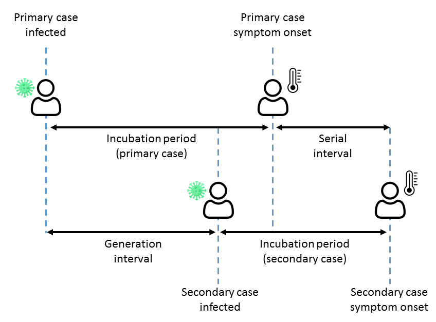

::: {.hidden}
$$
\newcommand{\vect}[1]{\boldsymbol{\mathbf{#1}}}
\newcommand{\R}{\mathcal{R}}
\newcommand{\Reff}{\mathcal{R}_\mathrm{eff}}
\newcommand{\inc}{\mathrm{inc}}
$$
:::

The models we covered in the previous Topic assumed that infections occurred in a series of non-overlapping generations, which simplified the analysis considerably. Here we will study a more general class of models in which infections occur in continuous time. 

# Stochastic SIR model

Similarly to the deterministic SIR model, suppose that each individual makes contacts with randomly selected members of the population as a Poisson process of intensity $c$ and that, if contact occurs between a susceptible and an infective, the susceptible is infected with probability $p$ and let $\beta=cp$. Suppose that infectives recover as a Poisson process of intensity $\gamma$. This defines a continuous-time Markov process with state variables $S(t)$ and $I(t)$ representing the number of susceptible and infectious individuals respectively. Note that, unlike the deterministic mean-field models studied earlier, the state variables are now always integer-valued.

::: {.callout-note}
### Stochastic SIR model

Let the random variables $S(t)$ and $I(t)$ denote the number of susceptible and infectious individuals respectively at time $t$.
Consider the continuous-time Markov process with two types of state transition:

1. **Transmission** $(S,I) \longrightarrow (S-1, I+1)$ occurs at rate $\beta SI/N$.
1. **Recovery** $(S,I) \longrightarrow (S,I-1)$ occurs at rate $\gamma I$. 

:::

Like the SIR model, the basic reproduction number is $\R_0=\beta/\gamma$.

# Extinction probability for a branching process in continuous time

In the early stages, when the population is almost fully susceptible, the model behave like a branching process but, unlike the models we saw in the previous Topic, in continuous time as opposed to discrete generations. 

Nonetheless, a similar approach may be used to calculate the probability of ultimate extinction (PUE) $q$ for an outbreak starting with a single infective.

Let the random variable $X$ denote the number of offspring of the initial infective. These all occur at different times but the outbreak as a whole goes extinct if and only if the transmission chains starting from all $X$ offspring go extinct. By conditioning on $X$, we obtain 
$$
q = \sum_{n=0}^\infty P(X=n)q^n = E(q^X)
$$

We may also condition on the length of the initial infective's infectious period $T_I$ to write
$$
q = E\left( E(q^X \ | \ T_I) \right)
$$

For a given value of $T_I=t_I$, $X$ has a Poisson distribution with mean $\beta t_I$, so $E(q^X \ | \ T_I=t_I) = e^{-\beta t_I(1-q) }$ (the generating function for a Poisson distribution), giving
$$
q = E\left(e^{-\beta T_I(1-q)}  \right)
$$
Observe that this is the moment generating function for $T_I$ evaluated at $-\beta(1-q)$ giving the following general result.

::: {.callout-note}
### Probability of ultimate extinction for a continuous-time branching process

For a continuous-time branching process where each infective transmits as a Poisson process of intensity $\beta$ for a random period of time $T_I$, the probability of ultimate extinction $q$ satisfies
$$
q = M_{T_I}(-\beta(1-q))
$$
where $M_{T_I}$ is the moment generating function for $T_I$.

:::

In the case where $T_I$ is exponentially distributed with mean $1/\gamma$, we obtain
$$
q = \frac{\gamma}{\gamma+\beta(1-q)} = \frac{1}{1+\R_0(1-q)}
$$
whose smallest root is $q=1$ if $\R_0<1$ and $q=1/\R_0$ if $\R_0>1$.

::: {.callout-note}
### Probability of ultimate extinction for a Markovian continuous-time branching process

For a continuous-time branching process where each the infectious period is exponentially distributed, the probability of extinction $q$ is 
$$
q = \left\{ \begin{array}{ll}  1, & \R_0\le 1 \\ \frac{1}{\R_0}, & \R_0 >1 \end{array} \right.
$$ {#eq-PUE-stochastic-SIR}
:::

This is consistent with the result in Topic 6 on branching processes because if individuals transit as a Poisson process for an exponentially distributed period of time, the number of offspring is geometrically distributed, which leads to the same expression for $q$ as in @eq-PUE-stochastic-SIR.

As for the branching process models with non-overlapping generations seen previously, if the outbreak starts with $m$ initial infectives, then the PUE is $q^m$.

If the branching process does not go extinct and a large epidemic occurs then, as for the SIR model, the expected fraction infected $z$ (assuming an initially susceptible population) satisfies the same final size equation $1-z=e^{-\R_0 z}$.

It is also possible to add more disease states, such as an exposed compartment, in the natural way but we omit this here.

Other theoretical results are available for this model (see [Britton, 2010](https://doi.org/10.1016/j.mbs.2010.01.006)) but are beyond the scope of these notes, so we now move our focus to computational simulation of the stochastic model.

# Stochastic SIR model simulation

## Gillespie algorithm

The stochastic SIR model (and Markovian models in general) can be simulated exactly using the *Gillespie algorithm*, which explicitly simulates every transition event in continuous time. 

::: {.callout-note}
### Gillespie algorithm

1. Set $t=0$, $S(t)=S_0$, $I(t)=I_0$. 
1. Calculate the transmission rate $r_1=\beta S(t)I(t)/N$ and recovery rate $r_2 = \gamma I(t)$. Set the total event rate $r=r_1+r_2$.
1. Generate the time until the next event $\delta t \sim \mathrm{Exp}(r)$.
1. Generate a uniform random deviate $u\sim U[0,1]$
1. If $u<r_1/(r_1+r_2)$ event is a transmission. Set $S(t+\delta t)=S(t)-1$ and $I(t+\delta t)=I(t)+1$
1. Else event is a recovery. Set $S(t+\delta t)=S(t)$ and $I(t+\delta t)=I(t)-1$
1. Update time variable to $t+\delta t$.
1. Return to step 2 until $I(t)=0$. 

:::

@fig-stochastic-SIR-Gillespie shows some example simulations using the Gillespie algorithm, alongside the solution of the corresponding deterministic SIR model and the mean of a large number of realisations. Note that, because different realisations peak at different times, the mean of the realisations produces a curve that systematically underestimates the size of the epidemic peak. In this case, the initial condition $I(0)$ was chosen to be large enough that the probability of extinction before a major outbreak was negligible. However, if a significant propotion of realisations went extinct in the early stages, the mean would be even less representative of a typical realisation. 
 
::: {.callout-tip}
### Averaging stochastic model outputs
 
 Caution is needed when calculating the average (either the mean or median) of time-dependent variables in stochastic models. It is often better to focus on relevant summary metrics (e.g. final epidemic size, maximum prevalence) that can be calculated for each realisation and report the statistics (e.g. mean, median, 2.5th and 97.5th percentiles) of those metrics. 
 
To visualise time-dependent behaviour, curve-based statistics can be useful, e.g. discard the most extreme 5\% of realisations. on some metric (such as final size) and construct an interval that traps the remaining 95\% of realisations. See [Juul et al. (2020)](https://doi.org/10.1038/s41567-020-01121-y) for more details.
 
:::

{#fig-stochastic-SIR-Gillespie}

Although the Gillespie algorithm is exact, it can be computationally intensive for large population sizes because the number of events that need to be individually simulated is very large.

## Fixed time step algorithm

An alternative method is to simulate the changes in $S(t)$ and $I(t)$ in fixed time steps. Since each susceptible gets infected at rate $\lambda(t)$ where $\lambda(t)=\beta I(t)/N$ is the force of infection, provided $\delta t$ is sufficiently small we may approximate the number of transmission events in the time interval $[t,t+\delta t]$ as $\mathrm{Bin}\left(S(t), \lambda(t)\delta t/N \right)$. Similarly, we approximate the number of recoveries at $\mathrm{Bin}\left( I(t), \gamma\delta t\right)$. Note that this formulation ensures that the state variables always remain non-negative integers.

::: {.callout-note}
### Simulating the stochastic SIR model with fixed time steps

$$
\begin{align}
S(t+\delta t) &= S(t)-X(t) \\
I(t+\delta t) &= I(t)+X(t) - Y(t)
\end{align}
$$

where 

$$
\begin{align}
X(t) & \sim \mathrm{Bin}\left( S(t), \frac{\beta I(t)}{N}\delta t\right) \\
Y(t) & \sim \mathrm{Bin}\left( I(t), \gamma\delta t \right) 
\end{align}
$$

:::

# Stochastic SIRS model simulation

We have previously seen how the deterministic SIR model can be extended to account for waning immunity by adding a transition from the R to the S compartment.
This can be done with the stochastic version of these models as well.

::: {.callout-note}
### Stochastic SIRS model

Let the random variables $S(t)$ and $I(t)$ denote the number of susceptible and infectious individuals respectively at time $t$.
Consider the continuous-time Markov process with three types of state transition:

1. **Transmission** $(S,I) \longrightarrow (S-1, I+1)$ occurs at rate $\beta SI/N$.
1. **Recovery** $(S,I) \longrightarrow (S,I-1)$ occurs at rate $\gamma I$. 
1. **Waning** $(S,I) \longrightarrow (S+1,I)$ occurs at rate $w (N-S- I)$. 

:::

As with the stochastic SIR model, this model can be simulated via a Gillespie algorithm or with a fixed time-step approximation. @fig-stochastic-SIRS shows some example simulations with two different waning rates and the same values of $\R_0$, $\gamma$ as for the SIR simulations in @fig-stochastic-SIR-Gillespie in a population of $N=10000$. 
When waning is fast (average immune period 20 days), the number of infectious individuals never drops below around 400 after the initial epidemic period. The stochastic simulation oscillates around the endemic equilibrium of the deterministic SIRS model (@fig-stochastic-SIRS(a)). 

However, when waning is slower (average immune period 200 days), after the first epidemic wave, the number of infectives predicted by the deterministic model drops to a small number (approximately 3 in this example). This means that the stochastic model trajectory has a reasonably high chance of going extinct, and this is what happens in @fig-stochastic-SIRS(b): the number of infectives drops to zero at around $t=150$ days and, since the model does not include imported infections, there is way for the epidemic to be reintroduced. This occurrence is sometimes called *stochastic fadeout*. 

Of course, in reality reintroductions may happen with some frequency, and this is straightforward to incorporate into the model. This will tend to result in trajectories oscillating around the deterministic model's endemic equilibrium in the long-term.

![Simulations of the continuous-time stochastic SIRS model with the Gillespie algorithm showing the number of infectious individuals $I(t)$ against time $t$ (top panels) and the trajectory in the $(S,I)$ phase plane (bottom panels) for two waning rates: (a) $w=0.05$ days$^{-1}$; (b) $w=0.005$ days$^{-1}$. Other parameter values: $\R_0=1.5$, $\gamma=0.25$ days$^{-1}$, population size $N=10000$, initial condition $I(0)=20$, $S(0)=N-I(0)$. Each plot shows a single realisations of the stochastic model (grey); and the solution of the deterministic SIRS model.](figures/stochastic_SIRS.png){#fig-stochastic-SIRS}

::: {.callout-tip}
### Stochastic fadeout

Stochastic fadeout is the name for what happens when the infection goes extinct in a stochastic model despite persisting in the equivalent mean-field model.
[Anderson and May](https://academic.oup.com/book/53038) distinguish between *epidemic fadeout* and *endemic fadeout*.

We have seen an example of epidemic fadeout in @fig-stochastic-SIRS(b). Following a large epidemic in an initially susceptible population, the prevalence of infected individuals drops to low levels, meaning there is a high chance of stochastic extinction. If the pathogen persists through the first few waves, the chance of this happening decreases because the inter-epidemic troughs get progressively higher. 

Endemic fadeout refers to the situation where the system is close to the deterministic model's endemic equilibrium, but intrinsic oscillations due to stochasticity (such as those see in @fig-stochastic-SIRS(a)) are large enough that there is a non-negligible probability that the number of infected individuals drops to zero at some point in time. 

Stochastic fadeout (of either type) is more likely in smaller populations and when the waning rate is slow relative to the infectious period (or infectious and latent period combined in an equivalent SEIRS model).

Similar observations apply to the SIR model with demography, where population turnover replaces waning immunity as the mechanism for replenishment of the susceptible population.

:::

# Non-Markovian models

Markovian models such as those described above assume that the waiting time in any given state is exponentially distributed. As we saw with the Kermack-McKendrick model, a more general approach assigns an average "infectiousness" $f(\tau)=\R_0 g(\tau)$ that depends on the age of infection $\tau$.

## Non-Markovian models in continuous time

Non-Markovian stochastic models commonly assume either: (A) that infectives transmit as a time-homogeneous Poisson process of intensity $\beta$ for some random period of time drawn form a specified distribution; or (B) that infectives make *infectious contacts* (i.e. contacts that would result in transmission if the person the contact is with is susceptible) as a time-inhomogeneous Poisson process of intensity $\beta(\tau)$ (although in principle both a random infectious period and a time-dependent infectiousness could be included, as in the general *Crump-Mode-Jagers* process). 

Here we will focus on assumption (B). In this case, we have $\beta(\tau)=\R_0 g(\tau)$ where $g(\tau)$ is the PDF for the generation interval distribution.

The force of infection $\lambda(t)$ at time $t$ is 
$$
\lambda(t) = \frac{\R_0}{N} \sum_j g(t-T_j)
$$
where $T_j$ is the time individual $j$ was infected.

Transmission events occur as an inhomogeneous Poisson process with intensity $\lambda(t)S(t)$ and hence the probability that no event occurs in the time interval $[t,t+s]$ is
$$
P(t) = \exp\left(-\int_t^{t+s} \lambda(t)S(t) dt \right)
$$

The time $\tau$ to the next transmission event may therefore be simulated by drawing $U\sim \mathrm{Uniform}[0,1]$ and setting $\tau=F^{-1}(U)$ where $F(t)=1-P(t)$ is the CDF of the time-to-next-event distribution. 

If required, the parent (i.e. infector) associated with the transmission event can be simulated by calculating the force of infection contributed by each infective $j$ over the time interval $[t,t+\tau]$
$$
\Lambda_j = \frac{\R_0}{N} \int_t^{t+\tau} g(s-T_j) ds
$$
The probability that the parent is individual $j$ is then just $\Lambda_j/\sum_k \Lambda_k$.

To be computationally tractable in a large population usually requires that there is some maximum generation interval $\tau_\mathrm{max}$ such that $g(\tau)=0$ for $\tau>\tau_\mathrm{max}$. This means that it is only necessary to keep track of infectives infected up to time $t-\tau_\mathrm{max}$. 

## Discrete time model

Although the process can be simulated in continuous time as outlined above, it is often easier in practice to work in discrete time by modelling the number of new infections $\inc_t$ that occur at time step $t$: 
$$
\inc_t \sim\mathrm{Bin}\left(S(t),  \frac{\R_0}{N} \sum_{s=1}^\infty \inc_{t-s} g_s   \right) 
$$ 
where $g_s$ is the probability mass function of the discretised generation interval distribution, such that $\sum_{s=1}^\infty g_s=1$ and with 
$$
S_{t+1}=S_t-\inc_t
$$
In a large population, a Poisson approximation is usually adequate:
$$
\inc_t \sim\mathrm{Poiss}\left(  \frac{ \R_0 S_t}{N} \sum_{s=1}^\infty \inc_{t-s} g_s   \right) 
$$ {#eq-Poiss-renewal}

This is known as the *Poisson renewal equation*. 

## Including individual heterogeneity

A limitation of this model is that each infective has the same time-dependent intensity function $\beta(\tau)$ and so the number of offspring from a given infective is Poisson distributed with mean $\R_0$. This means it can't model superspreading type dymamoics.

We saw in Topic 6 on branching processes that a common model for individual heterogeneity is where the offspring distribution is negative binomial, with some dispersion parameter $\kappa$. We also saw that this distribution derives from a situation where each infective has a Poisson number of offspring with an individual-specific mean that is gamma distributed. 

We can incorporate the same mechanism into this model by assigning each individual $j$ a transmission multiplier
$$
Y_j \sim \Gamma(\kappa, 1/\kappa)
$$
such that $E(Y_j)=1$, and giving individual $j$ intensity function $\beta_j(\tau) = \R_0 Y_j g(\tau)$. To implement this in the Poisson renewal equation, we need to know the sum of the $Y_j$'s for individual infected at a given time step $t$, which we will denote $\bar{Y}_t$. This is just the sum of a given number ($\inc_t$) of IID gamma random variables, which is also gamma disrtributed:
$$
\bar{Y}_t \sim \Gamma( \kappa \ \inc_t, 1/\kappa )
$$

This can be included in a modified Poisson renewal equation 
$$
\inc_t \sim\mathrm{Poiss}\left(  \frac{ \R_0 S_t}{N} \sum_{s=1}^\infty \bar{Y}_{t-s} g_s   \right) 
$$ 

In the limit $\kappa\to\infty$, $\bar{Y}_t\to \inc_t$ so the model reduces back to the standard Poisson renewal equation.

Note that this accounts for individual variation in infectiousness, but still assumes everyone has the same time-dependent infectiousness profile $g_s$, corresponding to the generation interval distribution. In reality, it is likely that individuals will all have different infectiousness profiles, and $g_s$ represents the population-level average. See [Kissler (2026)](https://doi.org/10.64898/2026.07.15.26358199) for a nice theoretical framework for including this.

# A taxonomy of models

By now we have some a variety of different types of model, and have learned different things each type. For example, we saw how $\R_0$ affects final epidemic size in the SIR model; we saw that the Kermack-McKendrick model can be used to test interventions that reduce transmission at a certain age of infection; and we saw how to calculate the probability of a large outbreak in the Galton-Watson branching process. 

Nevertheless, it can seem like there is a grab bag of unrelated infectious disease models. In fact, the various models are related in specific ways typically with one type being a special or limiting case of another. A useful way to classify model types and think about how they are related is to categorise models as either deterministic, or stochastic in discrete or continuous time, and either Markovian or non-Markovian. 

The following table illustrates this idea.

+--------------------------------------------+-------------------------------------------+------------------------------------------------+
|                                            | **Markovian**                             | **Non-Markovian**                              | +============================================+===========================================+================================================+
+--------------------------------------------+-------------------------------------------+------------------------------------------------+
| **Deterministic mean-field**               | S(E)IR                                    | Kermack-McKendrick                             |
+--------------------------------------------+-------------------------------------------+------------------------------------------------+
| **Stochastic non-overlapping generations** |- Galton-Watson (infinite pop)             |                                                |
|                                            |- Reed-Frost (finite pop)                  |                                                |
+--------------------------------------------+-------------------------------------------+------------------------------------------------+
| **Stochastic discrete time**               | Stochastic S(E)IR (fixed time steps)      | Renewal process                                |
+--------------------------------------------+-------------------------------------------+------------------------------------------------+
| **Stochastic continuous time**             | Stochastic S(E)IR (Gillespie)             | Crump-Mode-Jagers                              |
+--------------------------------------------+-------------------------------------------+------------------------------------------------+

# Important delays in infectious disease dynamics

There are a number of important delay times in infectious disease models (see @fig-delays). 

::: {.callout-tip}
### Delay times in infectious disease dynamics

* Latent period: the time from an individual getting infected to become infectious. 
* Incubation period: the time from an individual getting infected to onset of symptoms. 
* Generation interval: the time from infection of the primary case to infection of the secondary case.
* Serial interval: the time from symptom onset in the primary case to symptom onset in the secondary case.
* Time from infection or symptom onset to observed event. Often we are interested in observable downstream consequences of infection, such as positive test result, hospital admission or death. 

:::

Notes:

* We have used primary case and secondary case to refer to the infector and infectee respectively in a transmission pair. These are also sometimes referred to as the index case and secondary case, or the parent case and child case (though we avoid this terminology due to the potential confusion with age). 
* There is one latent period per infected individual and one incubation period per symptomatic infection. 
* There is one generation interval per infector-infectee pair and one serial interval per infector-infectee pair in which both individuals become symptomatic.
* The generation interval is usually a key input to models but is not directly observable. 
* Most of the delays above are always non-negative. The exception is the serial interval, which can be negative because it is possible for the child case to have symptom onset before the parent cases does. 

{width=500 #fig-delays}

The serial interval (SI) may be expressed in terms of the generation interval (GI) as
$$
\mathrm{SI} = \mathrm{GI} + T_{\mathrm{inc},2} - T_{\mathrm{inc},1}
$$
where $T_{\mathrm{inc},1}$ and $T_{\mathrm{inc},2}$ are the incubation periods of the parent and child cases respectively. Since $T_{\mathrm{inc},1}$ and $T_{\mathrm{inc},2}$ have the same mean, we see that the mean serial interval must equal the mean generation interval. However, if we assume that the generation interval and two incubation periods are independent, we get
$$
\mathrm{Var}(\mathrm{SI}) = \mathrm{Var}(\mathrm{GI}) + 2\mathrm{Var}(T_{\mathrm{inc}}) 
$$
This shows that the variance of the generation interval is always greater than that of the serial interval.

# Example: modelling case isolation

Here we will illustrate how an intervention based on isolating confirmed cases can be included in a stochastic model. In this situation, we need to distinguish between infected individuals who have not yet tested positive (who will contribute the full amount to the force of infection) and those that have (who will contribute a reduce amount to model the effects of case isolation. 

We also wish to include non-Markovian dynamics (e.g. because the GI and the time to isolation may not have exponential distributions). This is a situation where using a Markovian model is likely to give misleading results. 

It is possible to do this with a compartment-based model, for example we could define $X_{t,\tau}$ to be the number of people who were infected at time $t$ and have not yet tested positive at time $t+\tau$. However, for simplicity here will instead use an individual-based model and a simulation approach. Let's make the following modelling assumptions:

::: {.callout-tip}
### Model assumptions 

1. The number of infections caused by each infected, unisolated individual in a fully susceptible population is Poisson distributed with mean $\R_0$.
1. Each infected individual has probability $p_+\in[0,1]$ of ever testing positive, independent of other individuals.
1. In the absence of case isolation, the GI follows some specified distribution with probability mass function $g_t$.
1. The time from infection to positive test follows some specified distribution with probability mass function $u_t$..
1. After an individual has tested positive, their likelihood of transmitting is reduced to a factor $c_\mathrm{iso}\in[0,1]$ representing the effects of case isolation ($c_\mathrm{iso}=0$ corresponds to perfect case isolation; larger values of $c_\mathrm{iso}$ correspond to less effective case isolation).

:::

In point 2, note the qualifier "in the absence of case isolation". This is important because case isolation measures will change the GI distribution: because it takes time for isolation to begin, transmission events with a long GI are more likely to be prevented than those with a short GI.

## Model simulation

We may simulate this as a discrete time, non-Markovian model with the following algorithm:

1. Initialise the model with $m$ individuals infected on day $t=0$ by setting $T_{\mathrm{inf},i}=0$ for $i=1,\ldots,m$ and the cumulative number of infections $C_0=m$.
1. For each individual $i$ infected on day $t-1$, determine whether that individual will ever test positive by generating a Bernoulli$(p_+)$ random variable. If they do test positive, generate the time $T_{\mathrm{iso},i}$ until the positive test result by drawing from the specified distribution $u_t$. If they don't test positive set $T_{\mathrm{iso},i}=\infty$.
1. Compute the daily force of infection on day $t$ by summing over all previously infected individuals: 
$$
\lambda_{t} = \frac{\R_0}{N} \sum_{i=1}^{C_t}  g_{t-T_{\mathrm{inf},i}}\left(1-c_\mathrm{iso}\mathbb{I}(t>T_{\mathrm{inf},i}+T_{\mathrm{iso},i})\right)
$$
where $\mathbb{I}$ is the indicator function, which equals 1 if case $i$ has been isolated by day $t+1$ and zero otherwise.
1. Draw the number of new infections on day $t+1$ as 
$$
\inc_{t}\sim\mathrm{Poiss}\left(\lambda_{t} (N-C_{t-1})\right)
$$
Set $T_{\mathrm{inf},i}=t$ for all individuals $i$ infected on day $t$ and set $C_{t}=C_{t-1}+\inc_{t}$.
1. Increment $t$ by 1 and return to step 2.

Note this is not the only way to simulate this model. For example, an equivalent simulation would be to generate the number and timing of transmission events for each infected individual as soon as they become infected, thinning any that occur after isolation. 

## Outbreak controllability

As well as simulating the model, we may calculate the *control reproduction number* $\R_c$, defined in an analogous manner to $\R_0$ but with the case isolation control measure in place.

Let us use $Z_i$ to denote the number of people infected by individual $i$ in a fully susceptible population, such that $\R_c=E(Z_i)$. Note that, in the absence of case isolation, on day $s$ after infection individual $i$ infects a Poisson distributed number of people with mean $\R_0 g_s$. Hence the expected total number of people infected over the course of their infectious period is
$$
E(Z_i) = \sum_{s=1}^\infty \R_0 g_s = \R_0
$$
since $g_s$ is a PMF. This confirms that the basic reproduction number for the model above is $\R_0$. 

When case isolation is in place, the expected number of people infected by individual $i$ conditional on some finite time $\tau$ from infection to isolation is
$$
E(Z_i \ | \ T_{\mathrm{iso},i}=\tau) = \R_0\left( F_\tau + c_\mathrm{iso}(1-F_\tau)\right)
$$
where $F(s) = \sum_{s'=0}^s g_{s'}$ is the CDF of the generation interval. 

By the law of conditional expectation, we obtain
$$
E(Z_i) = E\left( E(Z_i \ | \ T_\mathrm{iso})\right) = \R_0\left[ c_\mathrm{iso} + (1-c_\mathrm{iso}) E\left(F(T_\mathrm{iso})  \right)\right]
$$ 
Note that $E\left(F(T_\mathrm{iso})  \right)$ is not the same thing as $F\left(E(T_\mathrm{iso})  \right)$ due to [Jensen's inequality](https://en.wikipedia.org/wiki/Jensen%27s_inequality): a function of the mean is not the same thing as the mean of the function. For specified GI and infection-to-isolation distributions, $E\left(F(T_\mathrm{iso})  \right)$ can be calculated via
$$
E\left(F(T_\mathrm{iso})  \right) = \sum_{s=0}^\infty F_s u_s 
$$ 
This quantity represents the average proportion of transmission (in the absence of case isolation measures) that occurs prior to the time of positive test result for people who test positive.

Since only some proportion $p_+$ of infected individuals ever test positive, we obtain
$$
\begin{align}
\R_c &= \R_0\left[ 1 - p_+ + p_+\left( c_\mathrm{iso} + (1-c_\mathrm{iso}) E\left(F(T_\mathrm{iso})  \right) \right)\right]\\
&= \R_0\left( c_\mathrm{iso} + (1-c_\mathrm{iso}) \theta \right)
\end{align}
$$ {#eq-Rc}
where we have used $\theta$ to denote $1-p_++p_+ E\left(F(T_{\mathrm{iso}})  \right)$.  The quantity $\theta\in[0,1]$ represents the average proportion of transmission (in the absence of case isolation measures)  that occurs from people who not yet tested positive (including those who will never test positive).

We can see from @eq-Rc that the control reproduction number $\R_c$ is an increasing function of $\theta$ (provided $c_\mathrm{iso}<1$, i.e. case isolation has some non-zero effect). This is what we should expect: the more transmission occurs from people who have not tested positive, the less impact case isolation measures will have.  

Note that @eq-Rc can be re-arranged to obtain the maximum value of $\theta$ for which $\R_c<1$, or the maximum value of $c_\mathrm{iso}$ (corresponding to the minimum isolation effectiveness) for which $\R_c<1$. This is useful for assessing whether an outbreak is controllable with case isolation measures. [Fraser et al. 2004](https://doi.org/10.1073/pnas.0307506101) considered the situation where people are isolated at the time they develop symptoms, so $\tau$ represents the incubation period, and $\theta$ represents the proportion of transmission that occurs in the absence of symptoms (either from pre-symptomatic or asymptomatic infectors). 

