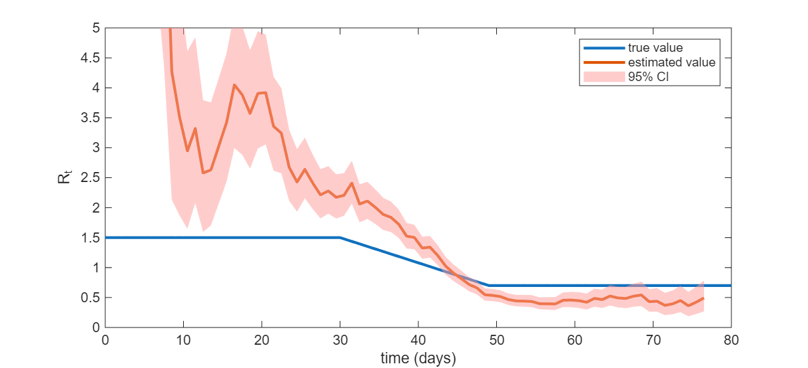

::: {.hidden}
$$
\newcommand{\vect}[1]{\boldsymbol{\mathbf{#1}}}
\newcommand{\R}{\mathcal{R}}
\newcommand{\Reff}{\mathcal{R}_\mathrm{eff}}
\newcommand{\inc}{\mathrm{inc}}
$$
:::


# Overview

Estimating the effective reproduction number from data is a common task in infectious disease modelling and epidemic analytics. 

In this Topic, we will consider various approaches and see how they perform when applied to synthetic data generated from a simple model where we *know* the true value of the thing we are trying to estimate (another use of the *simulation-estimation* method seen prevoiusly)

Here we will generate some synthetic data from the Poisson renewal model seen in Topic 7. Example daily incidence data from this model are shown in @fig-Rt-inference(a), where we have set $\R_t=1.5$ for $0\le t\le 30$ and then $\R_t$ decreases linearly to $0.7$ between $t=30$ and $t=50$. We have assumed that the generation interval distribution is a discretised gamma distribution with mean 5 days and standard deviation 2.5 days truncated at maximum 15 days.


Recall from the previous Topic that it is impossible to separately infer $\R_t$ and the generation interval. In this Topic, we will assume that we have access to an independent estimate for the generation interval distribution (e.g. from contact tracing data or a household study) and we will use this to enable estimates of $\R_t$. However, we will also see what happens if the generation interval estimate is wrong. 


::: {.callout-tip}
### Semi-mechnastic models 

Note that the models we are going to see are agnostic about what is causing $\R_t$ to vary over time. It could be depletion of the susceptible population, or it could be an intervention or other change that alters contact rates or transmission probabilities (think back to the DOTS framework we saw in Topic 1). 

For this reason, these are sometimes called *semi-mechanistic* models: they include a mechanistic transmission process by relating current infection incidence to past infection incidence, but they make only statistical rather than mechanistic assumptions about the processes controlling $\R_t$. 

:::


We will now look at a couple of simple methods for estimating $\R_t$ from this data, pretending for the moment that we don't know what the true $\R_t$ is, we only have the incidence data in @fig-Rt-inference(a). 


# Estimating directly from the deterministic renewal equation

The discrete-time version of the Kermack-McKendrick model expresses the incidence $\inc_t$ at time $t$ as a function of the previous incidence and the PMF $g_\tau$ of the generation interval distribution:
$$
\inc_t = \R_t \sum_{\tau=1}^\infty \inc_{t-\tau} g_\tau
$$ {#eq-KMK}

where $\R_t$ represents the effective reproduction number at time $t$. 


It follows from (@eq-KMK) that  
$$
\R_t = \frac{\inc_t}{\sum_{\tau=1}^\infty \inc_{t-\tau} g_\tau}
$$ {#eq-Rt-estimate-naive}

If incidence $\inc_t$  really did follow the deterministic model in @eq-KMK and we had perfect information about daily incidence (and we knew the correct generation interval distribution $g_\tau$), then we could simply apply this equation to calculate $\R_t$. In reality, this is rarely the case: observations will typically be noisy and often incomplete and delayed. 

The results of estimating $\R_t$ via @eq-Rt-estimate-naive are shown in @fig-Rt-inference(b). The estimates bear some resemblance to the true value of $\R_t$, but they are clearly very noisy with a not of variability from one day to the next. Furthermore, there is no measure of uncertainty in the estimates produced and so this method is not recommended.


::: {.callout-tip}
### Instantaneous reproduction number versus case reproduction number 

The reproduction number $\R_t$ referred to above is known as the *instantaneous reproduction number*. It measures the number of new infections occurring at an instant $t$ in time relative to the number of infections in the previous generation, weighted by their current infectiousness. 

This is not the same thing as the average number of people that an individual who became infected at time $t$ will infect, which is the *case reproduction number* denoted $\R^c_t$. If the population is fully susceptible, both the instantaneous and the case reproduction number are equal to $\R_0$. In general, $\R_t$ and $\R^c_t$ are related via the convolution equation
$$
\R^c_t =  \sum_{\tau=1}^\infty \R_{t+\tau} g_\tau
$$
In other words, the case reproduction number $\R_t^c$ is a weighted average of the instantaneous reproduction number over the case's infectious period, weighted by the case's time-dependent infectiousness. Hence $\R_t$ will tend to lag $\R_t^c$, which is a future-looking measure of reproductive output.

:::


# Estimation using the Poisson renewal model


To allow for noise, we can use a stochastic model. For example, the Poisson renewal equation we saw in Topic 7 adds Poisson noise to (@eq-KMK):
$$
\inc_t \sim \mathrm{Poiss}\left( \R_t \sum_{\tau=1}^\infty \inc_{t-\tau} g_\tau \right)
$$
We could estimate $\R_t$ independently each day using maximum likelihood and this would yield the same central estimate as (@eq-Rt-estimate-naive). As we have seen, however, this is highly sensitive to noise leading to large variations in $\R_t$ estimates from one day to the next. 

As a consequence, it is usually preferable to impose some constraints on how rapidly $\R_t$ can vary over time. One way to do this is to specify a prior for the function $\R_t$, such as Gaussian process, which penalises rapid variations. Another simple option is to estimate $\R_t$ over some time window. This has a mechanistic interpretation that generalises {#eq-Rt-estimate-naive}: if we we estimate $\R_t$ from the ratio of the incidence in the time window $[t,t+w]$ to the infection pressure exerted by previous infections over the same time window, we are estimating the average $\R_t$ during this time windows. By sliding the window of fixed width $W$ through time, we should obtain a smooth moving average.

Furthermore, we would like some uncertainty estimates on our estimates. We can do this by specifying a prior for the average value of $\R_t$ and using Bayes' rule to obtain the posterior distribution for $\R_t$ on each day $t$. This is the approach taken by the method known as *EpiEstim* [see Cori et al 2013](https://doi.org/10.1093/aje/kwt133). With the right choice of prior (called a *conjugate prior*), it possible to obtain a closed-form solution for the posterior, which is a gamma distribution with shape $a$ and scale $b$ given by
$$
a = a_p + \inc^W, \qquad b = \frac{b_p}{1 + b_p \Lambda^W}
$$ {#eq-epiestim-post}
where $a_p$ and $b_p$ are the prior shape and scale, $\inc^W$ is the incidence in the time window, and $\Lambda^W$ is the total infection pressure in the time window, defined in terms of the daily incidence data as
$$
\inc^W = \sum_{s=t-w+1}^t \inc_t, \qquad \Lambda^W=\sum_{s=t-w+1}^t \Lambda_s, \qquad \Lambda_t = \sum_{\tau=1}^\infty \inc_{t-\tau} g_\tau
$$

Notice that the mean posterior estimate for $\R_t$ is $\bar{R_t}=ab$ and in the limit of small $a_p$ and large $b_p$ (i.e. approximately uniform prior) this is
$$
\bar{\R}_W \approx \frac{ \sum_{s=t-w+1}^t \inc_t}{\sum_{s=t-w+1}^t  \sum_{\tau=1}^\infty \inc_{s-\tau} g_\tau }
$$
This has an intuitive interpretation as the ratio of the total number of incident infections in the time window $W$ to the aggregate infection pressure exerted by active infections during the time window. 

Note that in general, some of the infections in the data will be "external" (i.e. were not infected by one of the other infections in the data) as there must be at least one "seed" infection that started the outbreak (and there may be other individuals who were infected outside the region the data were collected from). These external infections should be included in the denominator (as the contribute to the force of infection) but not the numerator. 

If the estimation window is $[0,T]$ then this reduces to
$$
\bar{\R}_{[0,T]} \approx  \frac{ \sum_{s=0}^T \inc_t}{\sum_{s=0}^T \inc_s F_{T-s}} 
$$
where $F_t=\sum_{\tau=1}^t g_\tau$ is the CDF of the generation interval distribution. 

In the special case where there was a known number $m$ of seed infections at $t=0$ and the outbreaks ends in elimination with a total of $N$ locally acquired infections (i.e. excluding the seed cases), the above reduces to $\bar{\R}= N/(N+m)$ reflecting the $N$ infections that have arisen from $N+m$ infectors.


Note the estimates arising from @eq-epiestim-post can be sensitive to the choice of time window $w$. In general, short windows will be more sensitive to noise in the data, while long windows will be slow to respond to genuine changes in $\R_t$. The mean and 95\% credible interval of the posterior distribution produced using this method with an estimation window of $w=7$ days, and an exponential prior ($a_p=1$, $b_p=2$) are shown in @fig-Rt-inference(c). Note that the expressions above produce estimates for $\R_t$ at the end of the time window $[t-w,t]$. For these estimates to agree with the true $\R_t$ in @fig-Rt-inference(c), we needed to plot them at the centre of the time window (i.e. by shifting the time axis by 3.5 days).


![Estimation of the effective reproduction number $\R_t$: (a) synthetic daily incidence data generated from the Poisson renewal model; (b) estimation of $\R_t$ by directly inverting the renewal equation; (c) estimation of $\R_t$ using the EpiEstim method showing the mean and 95\% Bayesian credible interval. The known "true" value of $\R_t$ is shown as a blue line in (b) and (c). Generation interval distribution is discretised gamma with mean 5 days and standard deviation 2.5 days truncated at maximum 15 days.](figures/Rt_inference.png){#fig-Rt-inference}

Note that the results in @fig-Rt-inference assume that the true generation interval is accurately known. In reality, we will only have an imperfect estimate and this can impact $\R_t$ estimates. 

@fig-Rt-inference-mis shows the same result but with a mis-specificed generation interval mean of 10 days instead of 5 days. As we know, longer generation intervals lead to a steeper relationship between $\R_t$ and the epidemic growth rate $r$ (see Topic 2). Hence, to explain an observed growth rate $r>0$ in the data, $\R_t$ must be larger when the generation interval is longer. So, as we might expect, this biases $\R_t$ upwards when the epidemic is growing (and downwards when it is shrinking). 


{#fig-Rt-inference-mis}


# Practical issues with reproduction number estimation 

We have seen how to deal with noisy incidence data but there are a host of other issues that beset useful estimation of $\R_t$ from real-world data, including:

* Delays. Usually there is a delay from the infection event to the case being recorded in surveillance data, so we are generally looking back in time even with the most recent available data. 
* Under-ascertainment. Often not all infections are recorded in the data, and those that are may be a biased subset.
* Model mis-specification. Above we had the luxury of estimating $\R_t$ using the same model as was used to generate the data. That is never the case in the real world and if the model is mis-specified it can lead to biased estimates (for example mis-sepcification of the generation interval distribution seen above)
* Imported infections. The estimation methods described above assume that the cases recorded in the data were infected by previous cases recorded in the same dataset. If some of the cases are imported infections, this will tend to bias estimates upwards.

There are ways of dealing with these issues - [see Gostic et al (2020)](https://doi.org/10.1371/journal.pcbi.1008409) for a good overview. It is beyond the scope of these notes to cover them all in detail, but we will briefly looks at an R package called [EpiNow2](https://epiforecasts.io/EpiNow2/), which handles a lot of these - see [Abbot et al. (2020)](https://doi.org/10.12688/wellcomeopenres.16006.2) for more details. 


# Time series analysis with EpiNow2

Here we show some of the estimates produce by EpiNow2 when applied to synthetic incidence data. Readers are encourage to experiment with the R code, referring to the [EpiNow2 documentation](https://epiforecasts.io/EpiNow2/articles/EpiNow2.html). The R code blocks below load pre-fitted models to reduce unnecessary computations, but the R code to fit the models may be found in the directory 'epinow_model_fits/fit_models.R'.

@fig-epiNow2 shows plots of the synthetic incidence data along with the EpiNow2 model fit (i.e. the model's posterior predictions for daily incidence), as well as estimates of the time-dependent epidemic growth rate and reproduction number. The data is not too noisy, so the model provides a good fit with reasonably narrow confidence intervals. 

```{r}
#| fig-width: 5
#| fig-height: 8
#| label: fig-epiNow2
#| fig-cap: "EpiNow2 model fit to synthetic infection incidence data"
#| echo: false
#| warning: false
#| 
library('ggplot2') # We will use ggplot2 for plotting figures
library('patchwork') # We will use patchwork for creating multi-panel plots
library('EpiNow2') # We will use EpiNow2 for estimating the reproduction number from a time-series

######################################################################################################################################################
# 1. Reading in and visualising the data
######################################################################################################################################################
# Read in the dataset 'simulated_data.csv'
# The data set includes the daily infection incidence

df1 <- read.csv('epinow_model_fits/simulated_data.csv')
df1$date <- as.Date(df1$date)

# Load pre-fitted EpiNow2 model
model_fit_example <- readRDS('epinow_model_fits/model_fit_example.rds')

summary_example <- summary(model_fit_example, type = 'parameters')

# Create a plot of the synthetic incidence data along with the fitted model 

plt_inc <- ggplot()+
  geom_line(data = summary_example[summary_example$variable=="reported_cases",], aes(x=date, y=median))+
  geom_ribbon(data = summary_example[summary_example$variable=="reported_cases",], aes(x=date, y=median, ymin=lower_50, ymax=upper_50), alpha=0.2)+
  geom_ribbon(data = summary_example[summary_example$variable=="reported_cases",], aes(x=date, y=median, ymin=lower_90, ymax=upper_90), alpha=0.2)+
  theme_bw(base_size=14)+
  geom_point(data=df1, aes(x=date, y=incidence))+
  xlab("Date")+
  ylab("Infection incidence")


# The summary_example object also includes EpiNow2's modelled estimates of the Reproduction 
# number (variable==R) and the growth rate (variable==growth_rate)
#
# Visualise how the growth rate and reproduction number varied over time in two
# separate figures.
#
# On each figure mark the threshold for epidemic growth/decline with a horizontal 
# dashed line

plt_gr <- ggplot()+
  geom_line(data = summary_example[summary_example$variable=="growth_rate",], aes(x=date, y=median))+
  geom_ribbon(data = summary_example[summary_example$variable=="growth_rate",], aes(x=date, y=median, ymin=lower_50, ymax=upper_50), alpha=0.2)+
  geom_ribbon(data = summary_example[summary_example$variable=="growth_rate",], aes(x=date, y=median, ymin=lower_90, ymax=upper_90), alpha=0.2)+
  geom_hline(yintercept = 0, linetype="dashed")+
  theme_bw(base_size=14)+
  xlab("Date")+
  ylab("Growth rate")

plt_R <- ggplot()+
  geom_line(data = summary_example[summary_example$variable=="R",], aes(x=date, y=median))+
  geom_ribbon(data = summary_example[summary_example$variable=="R",], aes(x=date, y=median, ymin=lower_50, ymax=upper_50), alpha=0.2)+
  geom_ribbon(data = summary_example[summary_example$variable=="R",], aes(x=date, y=median, ymin=lower_90, ymax=upper_90), alpha=0.2)+
  geom_hline(yintercept = 1, linetype="dashed")+
  theme_bw(base_size=14)+
  xlab("Date")+
  ylab("Reproduction number")


# Plot infection incidence, growth rate, and reproduction number as one figure 
# with multiple panels. 
plt_inc + plt_gr + plt_R +plot_layout(nrow=3)
```


To investigate the effects of misspecifying the generation interval distribution, @fig-epiNow2-compare-GIs shows the EpiNow2 outputs under three different assumptions for the GI distribution: one where the mean is too high, one where it is too low, and one where it is correct. As we have seen previously, if the assumed GI is too high, estmiates of $\R_t$ are biased away from $1$ and vice versa if the assumed GI is too low. 

Notice however that the epidemic growth rate estimates are robust to misspecification of the GI. This is because the growth rate is essentially a feature of the data (recall exponential growth of rate $r$ corresponds to a straight line of slope $r$ on log-transformed data) and does not require any assumptions about the GI.


```{r}
#| fig-width: 8
#| fig-height: 6
#| label: fig-epiNow2-compare-GIs
#| fig-cap: "EpiNow2 estimates of the reproduction number and epidemic growth rate under three different assumptions about the generation interval distribution: with a mean that is too high (9 days, green), too low (2 days, orange) and the correct mean (5 days, purple)."
#| echo: false
#| warning: false
#| 
library('ggplot2') # We will use ggplot2 for plotting figures
library('patchwork') # We will use patchwork for creating multi-panel plots
library('EpiNow2') # We will use EpiNow2 for estimating the reproduction number from a time-series

# Read in the dataset 'simulated_data.csv'
# The data set includes the daily infection incidence

df1 <- read.csv('epinow_model_fits/simulated_data.csv')
df1$date <- as.Date(df1$date)

####### Load pre-fitted models #########

model_fit_example <- readRDS('epinow_model_fits/model_fit_example.rds')
model_gi_low <- readRDS('epinow_model_fits/model_gi_low.rds')
model_gi_high <- readRDS('epinow_model_fits/model_gi_high.rds')

summary_gi_low <- summary(model_gi_low, type = 'parameters')
summary_gi_original <- summary(model_fit_example, type = 'parameters')
summary_gi_high <- summary(model_gi_high, type = 'parameters')

# Produce a figure comparing the estimated reproduction numbers for each GI
plt_R <- ggplot()+
  geom_line(data = summary_gi_low[summary_gi_low$variable=="R",], aes(x=date, y=median, col='Low'))+
  geom_ribbon(data = summary_gi_low[summary_gi_low$variable=="R",], aes(x=date, y=median, ymin=lower_50, ymax=upper_50,  fill='Low'), alpha=0.2)+
  geom_ribbon(data = summary_gi_low[summary_gi_low$variable=="R",], aes(x=date, y=median, ymin=lower_90, ymax=upper_90,  fill='Low'), alpha=0.2)+
  geom_line(data = summary_gi_original[summary_gi_original$variable=="R",], aes(x=date, y=median, col='Original'))+
  geom_ribbon(data = summary_gi_original[summary_gi_original$variable=="R",], aes(x=date, y=median, ymin=lower_50, ymax=upper_50,  fill='Original'), alpha=0.2)+
  geom_ribbon(data = summary_gi_original[summary_gi_original$variable=="R",], aes(x=date, y=median, ymin=lower_90, ymax=upper_90,  fill='Original'), alpha=0.2)+
  geom_line(data = summary_gi_high[summary_gi_high$variable=="R",], aes(x=date, y=median, col='High'))+
  geom_ribbon(data = summary_gi_high[summary_gi_high$variable=="R",], aes(x=date, y=median, ymin=lower_50, ymax=upper_50,  fill='High'), alpha=0.2)+
  geom_ribbon(data = summary_gi_high[summary_gi_high$variable=="R",], aes(x=date, y=median, ymin=lower_90, ymax=upper_90,  fill='High'), alpha=0.2)+
  theme_bw(base_size=14)+
  scale_fill_brewer("Generation interval",palette = "Dark2")+
  scale_color_brewer("Generation interval",palette = "Dark2")+
  geom_hline(yintercept = 1, linetype="dashed")+
  xlab("Date")+
  ylab("Reproduction number")


# Produce a figure comparing the estimated growth rates for each GI
plt_gr <- ggplot()+
  geom_line(data = summary_gi_low[summary_gi_low$variable=="growth_rate",], aes(x=date, y=median, col='Low'))+
  geom_ribbon(data = summary_gi_low[summary_gi_low$variable=="growth_rate",], aes(x=date, y=median, ymin=lower_50, ymax=upper_50,  fill='Low'), alpha=0.2)+
  geom_ribbon(data = summary_gi_low[summary_gi_low$variable=="growth_rate",], aes(x=date, y=median, ymin=lower_90, ymax=upper_90,  fill='Low'), alpha=0.2)+
  geom_line(data = summary_gi_original[summary_gi_original$variable=="growth_rate",], aes(x=date, y=median, col='Original'))+
  geom_ribbon(data = summary_gi_original[summary_gi_original$variable=="growth_rate",], aes(x=date, y=median, ymin=lower_50, ymax=upper_50,  fill='Original'), alpha=0.2)+
  geom_ribbon(data = summary_gi_original[summary_gi_original$variable=="growth_rate",], aes(x=date, y=median, ymin=lower_90, ymax=upper_90,  fill='Original'), alpha=0.2)+
  geom_line(data = summary_gi_high[summary_gi_high$variable=="growth_rate",], aes(x=date, y=median, col='High'))+
  geom_ribbon(data = summary_gi_high[summary_gi_high$variable=="growth_rate",], aes(x=date, y=median, ymin=lower_50, ymax=upper_50,  fill='High'), alpha=0.2)+
  geom_ribbon(data = summary_gi_high[summary_gi_high$variable=="growth_rate",], aes(x=date, y=median, ymin=lower_90, ymax=upper_90,  fill='High'), alpha=0.2)+
  theme_bw(base_size=14)+
  scale_fill_brewer("Generation interval",palette = "Dark2")+
  scale_color_brewer("Generation interval",palette = "Dark2")+
  geom_hline(yintercept = 0, linetype="dashed")+
  xlab("Date")+
  ylab("Growth rate")


# Produce plots as one figure with two panels
plt_R + plt_gr +plot_layout(nrow=2)

```


## Accounting for delays

So far we have assumed that we have access to data on the incidence of new infections. This is rarely the case in practice and instead we are almost always limited to data relating ot downstream consequences of infections, e.g. case notification (which often relies on symptom onset), presentation for healthcare, or death. This has two important ramifications for model fitting:

1. We do not generally have data on *all* infections, only the subset of infections for which the downstream event occurs and is observed.
1. The downstream event typically occurs some time later than infection, which means the data is *delayed* (by some distributed time delay). 

As we have seen previously, one way to model this is by combining the Poisson renewal equation for daily infection incidence $\inc_t$
$$
\inc_t \sim \mathrm{Poiss}\left( \R_t \sum_{\tau=1}^\infty \inc_{t-\tau} g_\tau \right)
$$
with an observed variable 
$$
C_t \sim \mathrm{Poiss}\left(  p  \sum_{\tau=0}^\infty \inc_{t-\tau} u_\tau\right)
$$
where $p\in[0,1]$ is the probability that infection leads to the observed downstream event occurring, and $u_s$ is the PMF of the distribution of the number of days from infection to occurrence of the downstream event. 

This is a simplified model, but EpiNow2 uses this basic idea to allows observation delays to be included in the model. 

@fig-epiNow2-cases-no-delay shows EpiNow2 fits to the infection incidence data (top panel, as seen previously) and the reported case data (middle panel), assuming incorrectly that there is no delay from infection to case notification. This means that the reproduction number estimates based on reported case data (orange curve in bottom panel) are shifted to the right compared to the "correct" reproduction number (green curve in bottom panel). 


```{r}
#| fig-width: 8
#| fig-height: 9
#| label: fig-epiNow2-cases-no-delay
#| fig-cap: "EpiNow2 model fits to synthetic data on daily infection incidence (top panel) and on new daily reported cases (middle panel), assuming no delay from infection to case notification. Bottom panel shows the reproduction number estimates from fitting to infection incidence data (orange) and reported case data (green)."
#| echo: false
#| warning: false
#| 
library('ggplot2') # We will use ggplot2 for plotting figures
library('patchwork') # We will use patchwork for creating multi-panel plots
library('EpiNow2') # We will use EpiNow2 for estimating the reproduction number from a time-series

# Read in the dataset 'simulated_data.csv'
# The data set includes the daily infection incidence

df1 <- read.csv('epinow_model_fits/simulated_data.csv')
df1$date <- as.Date(df1$date)

####### Load pre-fitted models #########

model1 <- readRDS('epinow_model_fits/model_fit_example.rds') # model fit to infection incidence
model2 <- readRDS('epinow_model_fits/model_cases.rds') # model fit to reported cases

summary1 <- summary(model1, type = 'parameters')
summary2 <- summary(model2, type = 'parameters')

# Produce a figure of the model fit to infections
plt1 <- ggplot()+
  geom_line(data = summary1[summary1$variable=="infections",], aes(x=date, y=median))+
  geom_ribbon(data = summary1[summary1$variable=="infections",], aes(x=date, y=median, ymin=lower_50, ymax=upper_50), alpha=0.2)+
  geom_ribbon(data = summary1[summary1$variable=="infections",], aes(x=date, y=median, ymin=lower_90, ymax=upper_90), alpha=0.2)+
  theme_bw(base_size=14)+
  geom_point(data=df1, aes(x=date, y=incidence))+
  xlab("Date")+
  ylab("Infection incidence")

# Produce a figure of the model fit to reported cases
plt2 <- ggplot()+
  geom_line(data = summary2[summary2$variable=="reported_cases",], aes(x=date, y=median))+
  geom_ribbon(data = summary2[summary2$variable=="reported_cases",], aes(x=date, y=median, ymin=lower_50, ymax=upper_50), alpha=0.2)+
  geom_ribbon(data = summary2[summary2$variable=="reported_cases",], aes(x=date, y=median, ymin=lower_90, ymax=upper_90), alpha=0.2)+
  theme_bw(base_size=14)+
  geom_point(data=df1, aes(x=date, y=cases))+
  xlab("Date")+
  ylab("Reported cases")

# Produce a plot comparing R estimates made using each of the four different time series
plt3 <- ggplot()+
  geom_line(data = summary1[summary1$variable=="R",], aes(x=date, y=median, col='Infections'))+
  geom_ribbon(data = summary1[summary1$variable=="R",], aes(x=date, y=median, ymin=lower_50, ymax=upper_50,  fill='Infections'), alpha=0.2)+
  geom_ribbon(data = summary1[summary1$variable=="R",], aes(x=date, y=median, ymin=lower_90, ymax=upper_90,  fill='Infections'), alpha=0.2)+
  geom_line(data = summary2[summary2$variable=="R",], aes(x=date, y=median, col='Reported cases'))+
  geom_ribbon(data = summary2[summary2$variable=="R",], aes(x=date, y=median, ymin=lower_50, ymax=upper_50,  fill='Reported cases'), alpha=0.2)+
  geom_ribbon(data = summary2[summary2$variable=="R",], aes(x=date, y=median, ymin=lower_90, ymax=upper_90,  fill='Reported cases'), alpha=0.2)+
  theme_bw(base_size=14)+
  scale_fill_brewer("Time series",palette = "Dark2")+
  scale_color_brewer("Time series",palette = "Dark2")+
  geom_hline(yintercept = 1, linetype="dashed")+
  xlab("Date")+
  ylab("Reproduction number")


# Produce plots as one figure with two panels
plt1 + plt2 + plt3 +plot_layout(nrow=3)
```


We can properly account for the delay by telling EpiNow2 that the time from infection to case notification is the sum of the incubation period, which in this example was a gamma distribution with mean 3 days and s.d. 2 days, and the delay from symptom onset to notification, which was a gamma distribution with mean 2 days and s.d. 1.6 days. 

The result of this is shown in @fig-epiNow2-cases-delay. Here we see that the reproduction number inferred from the reported case data (orange curve in bottom panel) more closely matches the true reproduction number (green curve in bottom panel). We also see that the inferred daily incidence of infections (red curve in middle panel) correctly matches the timing of the true infection incidence (top panel). If we had done the same thing in @fig-epiNow2-cases-no-delay where we didn't account for the delay, the red curve would (incorrectly) have the same timing as the reported cases 


```{r}
#| fig-width: 8
#| fig-height: 9
#| label: fig-epiNow2-cases-delay
#| fig-cap: "EpiNow2 model fits to synthetic data on daily infection incidence (top panel) and on new daily reported cases (middle panel), correctly accounting for the delay from infection to case notification as the sum of two independent gamma distributions, one with mean 3 days and s.d. 2 days, and one with mean 2 days and s.d. 1.6 days. The red curve in the middle panel shows the estimated daily infection incidence inferred from the reported case data. Bottom panel shows the reproduction number estimates from fitting to infection incidence data (orange) and reported case data (green)."
#| echo: false
#| warning: false
#| 
library('ggplot2') # We will use ggplot2 for plotting figures
library('patchwork') # We will use patchwork for creating multi-panel plots
library('EpiNow2') # We will use EpiNow2 for estimating the reproduction number from a time-series

# Read in the dataset 'simulated_data.csv'
# The data set includes the daily infection incidence

df1 <- read.csv('epinow_model_fits/simulated_data.csv')
df1$date <- as.Date(df1$date)

####### Load pre-fitted models #########

model1 <- readRDS('epinow_model_fits/model_fit_example.rds') # model fit to infection incidence
model2 <- readRDS('epinow_model_fits/model_cases_delay.rds') # model fit to reported cases

summary1 <- summary(model1, type = 'parameters')
summary2 <- summary(model2, type = 'parameters')

# Produce a figure of the model fit to infections
plt1 <- ggplot()+
  geom_line(data = summary1[summary1$variable=="infections",], aes(x=date, y=median))+
  geom_ribbon(data = summary1[summary1$variable=="infections",], aes(x=date, y=median, ymin=lower_50, ymax=upper_50), alpha=0.2)+
  geom_ribbon(data = summary1[summary1$variable=="infections",], aes(x=date, y=median, ymin=lower_90, ymax=upper_90), alpha=0.2)+
  theme_bw(base_size=14)+
  geom_point(data=df1, aes(x=date, y=incidence))+
  xlab("Date")+
  ylab("Infection incidence")

# Produce a figure of the model fit to reported cases
plt2 <- ggplot()+
  geom_line(data = summary2[summary2$variable=="reported_cases",], aes(x=date, y=median))+
  geom_ribbon(data = summary2[summary2$variable=="reported_cases",], aes(x=date, y=median, ymin=lower_50, ymax=upper_50), alpha=0.2)+
  geom_ribbon(data = summary2[summary2$variable=="reported_cases",], aes(x=date, y=median, ymin=lower_90, ymax=upper_90), alpha=0.2)+
  theme_bw(base_size=14)+
  geom_point(data=df1, aes(x=date, y=cases))+
  xlab("Date")+
  ylab("Reported cases")

plt2 <- plt2 + 
  geom_line(data = summary2[summary2$variable=="infections",], aes(x=date, y=median), col='darkred')+
  geom_ribbon(data = summary2[summary2$variable=="infections",], aes(x=date, y=median, ymin=lower_50, ymax=upper_50), fill='darkred', alpha=0.2)+
  geom_ribbon(data = summary2[summary2$variable=="infections",], aes(x=date, y=median, ymin=lower_90, ymax=upper_90),fill='darkred', alpha=0.2)


# Produce a plot comparing R estimates made using each of the different time series
plt3 <- ggplot()+
  geom_line(data = summary1[summary1$variable=="R",], aes(x=date, y=median, col='Infections'))+
  geom_ribbon(data = summary1[summary1$variable=="R",], aes(x=date, y=median, ymin=lower_50, ymax=upper_50,  fill='Infections'), alpha=0.2)+
  geom_ribbon(data = summary1[summary1$variable=="R",], aes(x=date, y=median, ymin=lower_90, ymax=upper_90,  fill='Infections'), alpha=0.2)+
  geom_line(data = summary2[summary2$variable=="R",], aes(x=date, y=median, col='Reported cases'))+
  geom_ribbon(data = summary2[summary2$variable=="R",], aes(x=date, y=median, ymin=lower_50, ymax=upper_50,  fill='Reported cases'), alpha=0.2)+
  geom_ribbon(data = summary2[summary2$variable=="R",], aes(x=date, y=median, ymin=lower_90, ymax=upper_90,  fill='Reported cases'), alpha=0.2)+
  theme_bw(base_size=14)+
  scale_fill_brewer("Time series",palette = "Dark2")+
  scale_color_brewer("Time series",palette = "Dark2")+
  geom_hline(yintercept = 1, linetype="dashed")+
  xlab("Date")+
  ylab("Reproduction number")

# Produce plots as one figure with three panels
plt1 + plt2 + plt3 +plot_layout(nrow=3)
```


## Real-time estimation

In the examples above, we have data for the whole epidemic wave and so the model fits provide a retrospective analysis of how $\R_t$ and infection incidence varies over the course of the completed epidemic. 

In reality, we are often interested in estimating these variables in real-time, when we only have partial data. @fig-epiNow2-RT shows model fits to the same time series for infections and reported cases, but only including data up to 1 March. 

The infection incidence has peaked just before the end of the available data, but this is not necessarily obvious looking at noisy real-time data. However, the reproduction number estimate from the infection data (orange curve in bottom panel) has just gone under $1$ and has quite narrow confidence intervals, meaning we have high confidence that the epidemic has peaked. 

If we only had access to the reported case data up to 1 March, we only really have any information about $\R_t$ and infection incidence up to about a week or so previously because of the lag from infection to case notification. This means that estimates of $\R_t$ beyond around 21 February become progressively less informed by data and hence revert more towards the prior used by EpiNow2. As a consequence, the confidence intervals on $\R_t$ get steadily wider in the last week or so of data. 

In this example, we would have been less confident that the epidemic had peaked since the confidence interval of the orange curve in the bottom panel of @fig-epiNow2-RT contains $\R_t=1$. Similarly we would be less certain about the number of new infections in the most recent week, as indicated by the expanding confidence intervals on the red curve in the middle panel. 


```{r}
#| fig-width: 8
#| fig-height: 9
#| label: fig-epiNow2-RT
#| fig-cap: "EpiNow2 model fits to the same synthetic data on daily infection incidence (top panel) and on new daily reported cases (middle panel) as in the previous figure, but truncated at 1 March. The red curve in the middle panel shows the estimated daily infection incidence inferred from the reported case data. Bottom panel shows the reproduction number estimates from fitting to infection incidence data (orange) and reported case data (green)."
#| echo: false
#| warning: false
#| 
library('ggplot2') # We will use ggplot2 for plotting figures
library('patchwork') # We will use patchwork for creating multi-panel plots
library('EpiNow2') # We will use EpiNow2 for estimating the reproduction number from a time-series

# Read in the dataset 'simulated_data.csv'
# The data set includes the daily infection incidence

df0 <- read.csv('epinow_model_fits/simulated_data.csv')
df0$date <- as.Date(df0$date)

df1 <- df0[df0$date<=as.Date("2025-03-01"),]

####### Load pre-fitted models #########
model1 <- readRDS('epinow_model_fits/mar_model_infections.rds') # model fit to infection incidence (data up to 1 March)
model2 <- readRDS('epinow_model_fits/mar_model_cases_delay.rds') # model fit to reported cases with delay (data up to 1 March)

summary1 <- summary(model1, type = 'parameters')
summary2 <- summary(model2, type = 'parameters')

# Produce a figure of the model fit to infections
plt1 <- ggplot()+
  geom_line(data = summary1[summary1$variable=="infections",], aes(x=date, y=median))+
  geom_ribbon(data = summary1[summary1$variable=="infections",], aes(x=date, y=median, ymin=lower_50, ymax=upper_50), alpha=0.2)+
  geom_ribbon(data = summary1[summary1$variable=="infections",], aes(x=date, y=median, ymin=lower_90, ymax=upper_90), alpha=0.2)+
  theme_bw(base_size=14)+
  geom_point(data=df1, aes(x=date, y=incidence))+
  scale_x_date(limits = as.Date(c("2025-02-10", "2025-03-01")))+
  coord_cartesian(ylim = c(2500, NA))+
  xlab("Date")+
  ylab("Infection incidence")

# Produce a figure of the model fit to reported cases
plt2 <- ggplot()+
  geom_line(data = summary2[summary2$variable=="reported_cases",], aes(x=date, y=median))+
  geom_ribbon(data = summary2[summary2$variable=="reported_cases",], aes(x=date, y=median, ymin=lower_50, ymax=upper_50), alpha=0.2)+
  geom_ribbon(data = summary2[summary2$variable=="reported_cases",], aes(x=date, y=median, ymin=lower_90, ymax=upper_90), alpha=0.2)+
  theme_bw(base_size=14)+
  geom_point(data=df1, aes(x=date, y=cases))+
  scale_x_date(limits = as.Date(c("2025-02-10", "2025-03-01")))+
  coord_cartesian(ylim = c(500, 1500))+
  xlab("Date")+
  ylab("Reported cases")

plt2 <- plt2 + 
  geom_line(data = summary2[summary2$variable=="infections",], aes(x=date, y=median), col='darkred')+
  geom_ribbon(data = summary2[summary2$variable=="infections",], aes(x=date, y=median, ymin=lower_50, ymax=upper_50), fill='darkred', alpha=0.2)+
  geom_ribbon(data = summary2[summary2$variable=="infections",], aes(x=date, y=median, ymin=lower_90, ymax=upper_90),fill='darkred', alpha=0.2)


# Produce a plot comparing R estimates made using each of the different time series
plt3 <- ggplot()+
  geom_line(data = summary1[summary1$variable=="R",], aes(x=date, y=median, col='Infections'))+
  geom_ribbon(data = summary1[summary1$variable=="R",], aes(x=date, y=median, ymin=lower_50, ymax=upper_50,  fill='Infections'), alpha=0.2)+
  geom_ribbon(data = summary1[summary1$variable=="R",], aes(x=date, y=median, ymin=lower_90, ymax=upper_90,  fill='Infections'), alpha=0.2)+
  geom_line(data = summary2[summary2$variable=="R",], aes(x=date, y=median, col='Reported cases'))+
  geom_ribbon(data = summary2[summary2$variable=="R",], aes(x=date, y=median, ymin=lower_50, ymax=upper_50,  fill='Reported cases'), alpha=0.2)+
  geom_ribbon(data = summary2[summary2$variable=="R",], aes(x=date, y=median, ymin=lower_90, ymax=upper_90,  fill='Reported cases'), alpha=0.2)+
  theme_bw(base_size=14)+
  scale_fill_brewer("Time series",palette = "Dark2")+
  scale_color_brewer("Time series",palette = "Dark2")+
  geom_hline(yintercept = 1, linetype="dashed")+
  scale_x_date(limits = as.Date(c("2025-02-10", "2025-03-01")))+
  coord_cartesian(ylim = c(0.8, 1.5))+
  xlab("Date")+
  ylab("Reproduction number")

# Produce plots as one figure with three panels
plt1 + plt2 + plt3 +plot_layout(nrow=3)
```


## Acknowledgements

The content relating to EpiNow2 is based on teaching materials and code developed by Dr Oliver Eales.


